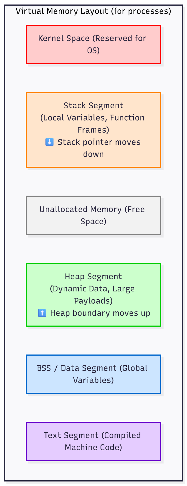

# 1.1 Process and Memory Management

### Setup Stage

To deeply understand memory management (the Stack, the Heap, and Virtual Memory), we must observe how the Operating System allocates hardware resources to a running piece of code. 

Languages like JavaScript or Python abstract memory management away from the developer using a Garbage Collector. To see the raw mechanics of memory allocation, we will use C++ for Stage 3 of this sub-phase. C++ requires explicit instructions to request and release memory, allowing us to map exactly how the OS responds.

We need to ensure your WSL2 (Ubuntu) / Linux environment has the necessary compiler and tools.

Please open your WSL2 / Linux  terminal and run the following commands to install the GCC C++ compiler and core Linux utilities:

```bash
# Update package lists
sudo apt update

# Install the essential compilation tools (includes g++)
sudo apt install build-essential

# Verify the installation was successful
g++ --version
```

---

### Stage 1: Concept & Core Problem (Processes & Memory Management)

Let's start from the absolute basics of how a computer executes code and manages data.

#### Step 1: Program vs. Process
A **Program** is a static file resting on your hard drive (disk). It consists of compiled binary instructions (machine code) and static data. It does absolutely nothing until invoked. 

A **Process** is the active, executing instance of that program. When you execute a program, the Operating System (OS) reads the binary file from the disk and loads it into the main memory (RAM). The OS allocates a dedicated CPU thread to begin executing those instructions sequentially. A single program can be spawned as multiple, independent processes (e.g., opening multiple Chrome tabs).

#### Step 2: Virtual Memory & Isolation
When a process is loaded into RAM, the OS does not give it direct access to the physical memory chips. If processes could access physical RAM directly, Process A could overwrite Process B's memory, causing system crashes and severe security breaches.

Instead, the OS assigns every process an illusion called **Virtual Memory**. 
When a process is created, the OS tells it: *"You have access to a massive, contiguous block of memory starting from address `0x00000000` up to `0xFFFFFFFF`."* 

In reality, the OS and the CPU's hardware (the Memory Management Unit, or MMU) maintain a mapping table. When the process tries to read or write to its virtual address, the hardware translates it into a secure, isolated physical RAM address. 
*   **The Problem This Solves:** Total isolation. If a process crashes and corrupts its memory, it only corrupts its own Virtual Memory. The rest of the OS and other processes remain perfectly safe.

#### Step 3: The Virtual Memory Layout
The OS strictly divides this Virtual Memory space into specific segments. Each segment serves a different mechanical purpose in computing:

1. **Text Segment:** Stores the compiled machine code instructions. This is read-only to prevent the process from accidentally modifying its own code.
2. **Data/BSS Segment:** Stores global and static variables initialized by the developer.
3. **The Stack:** Managed automatically by the CPU.
4. **The Heap:** Managed manually by the programmer (or a Garbage Collector).

#### Step 4: The Core Engineering Problem: Stack vs. Heap
To process data, a program needs to store variables. The core engineering problem is determining **how long** data needs to live and **how fast** it must be accessed. The OS solves this by offering two different memory architectures: the Stack and the Heap.

**The Stack (Fast, Deterministic, LIFO):**
When a function is called, the CPU pushes a "Stack Frame" onto the Stack. This frame contains the function's local variables, arguments, and the return memory address (where the CPU should resume execution after the function finishes).
*   **Mechanics:** It operates on a strict Last-In, First-Out (LIFO) basis. Memory allocation is practically instantaneous—it is merely moving a hardware pointer up or down. When the function finishes, its stack frame is instantly popped off, and the memory is reclaimed. 
*   **Constraint:** The size of the variables must be known at compile-time (e.g., standard integers, fixed-size pointers). The total Stack size is strictly limited (often just a few Megabytes). If you nest too many function calls, the Stack overflows its memory boundary (Stack Overflow) and the OS kills the process.

**The Heap (Dynamic, Persistent, Slower):**
What if a server receives a dynamic JSON payload over a network, and we don't know if it will be 1 Kilobyte or 10 Megabytes? We cannot use the Stack because its size is too limited and must be known in advance. We must use the Heap.
*   **Mechanics:** The Heap is a massive pool of unallocated memory. To use it, the program makes a System Call to the OS requesting a specific amount of bytes. The OS searches the Heap, finds a contiguous block of free memory, marks it as "in-use", and returns a memory address (a pointer) pointing to that block.
*   **Constraint:** Because the OS has to track which blocks are free and which are used, allocation is slower. Furthermore, data on the Heap does *not* automatically disappear when a function finishes. It persists until the programmer explicitly tells the OS to free it. If you lose the pointer to the memory but forget to free it, you have a **Memory Leak**.

#### Virtual Memory Layout Visualization
<center>
    
</center>

---

### Stage 2: Technical Walkthrough (Processes & Memory Management)

Let us examine exactly how a server environment manipulates the Stack and the Heap during a standard operation: receiving and processing an incoming network request payload. 

We will trace the exact data flow and CPU mechanics step-by-step.

#### Step 1: Process Initialization
When you start the server application, the Operating System reads the compiled binary file. It creates a new Process, allocates a Virtual Memory address space, and loads the binary instructions into the **Text Segment**. 

The OS then initializes the **Stack Segment** with a predetermined size (e.g., 8 Megabytes) and sets a CPU register called the *Stack Pointer*. The Stack Pointer holds the exact memory address of the current top of the Stack. The CPU begins executing instructions sequentially from the `main()` function.

#### Step 2: Pushing to the Stack (Function Invocation)
The server waits for a connection. A network request arrives. The CPU reads an instruction to call a function named `handleRequest(int connectionId)`. 

When this function is called, the CPU performs a hardware-level operation:
1. It pushes the current memory address of the executing instruction (the Return Address) onto the Stack so it knows where to go back to later.
2. It pushes the `connectionId` integer (e.g., 4 bytes) onto the Stack.
3. It moves the Stack Pointer down to reserve space for any local variables declared inside `handleRequest()`.

Because the integer size is known and the Stack Pointer moves via hardware instructions, this allocation takes just a few CPU cycles. It is incredibly fast.

#### Step 3: Requesting Heap Allocation (Dynamic Data)
Inside `handleRequest()`, the server begins reading the incoming network payload (e.g., a JSON body). The server does not know if this JSON payload is 100 bytes or 10 Megabytes. It cannot store this on the Stack because the Stack requires known, fixed sizes at compile time, and an unexpected 10MB payload would cause a Stack Overflow.

The process must ask the OS for memory on the **Heap**.
1. The code executes a memory allocation command (like `malloc()` in C/C++ or `new` in other languages).
2. This triggers a System Call (specifically `brk` or `mmap` in Linux). The process pauses execution and switches into Kernel Mode.
3. The OS kernel inspects the Heap Segment of this process's Virtual Memory. It searches its internal data structures to find a contiguous block of free memory large enough to hold the incoming payload.
4. The OS marks that specific block as "in-use", updates the Heap boundary, and returns control to the process. 

#### Step 4: Bridging the Stack and the Heap (Pointers)
The OS does not hand the data directly to the function. Instead, it returns a **Pointer**. 
A pointer is simply an integer representing the starting memory address of that new block on the Heap (e.g., `0x55a1b2c3d4e5`).

On a 64-bit machine, a pointer is exactly 64 bits (8 bytes) long. Because this size is fixed and known, *the pointer itself* is saved as a local variable inside the current Stack Frame. 
The application then reads the network bytes and writes them into the Heap memory at the address the pointer specifies.

The critical mechanic here is separation: **The reference (the pointer) lives on the Stack, but the actual data (the payload) lives on the Heap.**

#### Step 5: Execution Completion & The Memory Leak Threat
Once the JSON is processed and the server prepares to send a response, the `handleRequest()` function completes.

The CPU immediately executes a hardware `POP` instruction. The Stack Pointer moves back up, instantly destroying the Stack Frame. The local `connectionId` integer and the *Pointer* variable are wiped from existence.

However, the OS does **not** automatically wipe the Heap. The 10 Megabytes of payload data is still sitting in the Heap, marked as "in-use" by the OS. 

If the programmer did not write explicit code to release that Heap memory (e.g., `free()` or `delete`) *before* the function finished, the process now has a **Memory Leak**. The process no longer holds the pointer, so it cannot access the memory, but the OS still believes the memory is active. 

If this happens on every network request, the Heap will grow larger and larger. Eventually, the Virtual Memory will exhaust the physical RAM, and the Linux kernel's Out-Of-Memory (OOM) Killer will forcefully terminate the process to save the operating system from crashing.

--- 

### Stage 3: *Headover to src/ for code implementations*

---

### Stage 4: Code Breakdown (Processes & Memory Management)

Here is a line-by-line breakdown mapping the code directly back to the architectural theory (Stage 1) and the system runtime mechanics (Stage 2).

#### Process Initialization
```cpp
int main() {
    size_t payloadSize = 10 * 1024 * 1024;
```
*   **Mechanics (Stage 2, Step 1):** When you executed `./memory_demo`, the Linux OS read the compiled binary file, allocated a Virtual Memory address space, and loaded these machine instructions into the **Text Segment**.
*   The CPU starts executing at `main()`. A Stack Frame for `main()` is pushed onto the **Stack**. The variable `payloadSize` is a fixed-size integer (often 8 bytes for `size_t` on 64-bit systems) pushed directly onto the Stack.

#### Executing the Proper Request (Bridging Stack and Heap)
```cpp
handleRequestProperly(101, payloadSize);
```
*   **Mechanics (Stage 2, Step 2):** The CPU pushes the memory address of the next instruction (the Return Address) onto the Stack so it can come back here later. It then pushes the arguments (`101` and `10485760`) onto the Stack and jumps to the `handleRequestProperly` instructions.

```cpp
void handleRequestProperly(int connectionId, size_t payloadSize) {
    int localConnectionId = connectionId;
```
*   **Architecture (Stage 1):** This integer is explicitly placed in the new Stack Frame. The CPU's hardware Stack Pointer registers a downward move of 4 bytes. This is virtually instantaneous and requires zero involvement from the OS kernel.

```cpp
    char* payloadPtr = new char[payloadSize]; 
```
*   **Mechanics (Stage 2, Steps 3 & 4):** This is the core operation bridging our two memory regions.
    *   `new char[payloadSize]`: The C++ runtime pauses the process and issues a System Call (`brk` or `mmap`) to the OS kernel. The OS inspects the **Heap Segment**, finds a contiguous 10-Megabyte block of unallocated memory, marks it as "in-use", and returns its physical starting address.
    *   `char* payloadPtr`: This variable is an 8-byte integer (on a 64-bit machine) living entirely on the **Stack**. It holds the memory address returned by the OS. The reference is on the fast, limited Stack; the massive 10MB data block is on the slower, dynamic Heap.

```cpp
    std::memset(payloadPtr, 'A', payloadSize - 1);
    payloadPtr[payloadSize - 1] = '\0';
```
*   The CPU uses the memory address stored in the Stack's `payloadPtr` to write raw bytes ('A') directly into the allocated block in the **Heap Segment**.

```cpp
    delete[] payloadPtr;
}
```
*   **Mechanics (Stage 2, Step 5):** This explicitly prevents a memory leak. Before the function finishes, the process tells the OS: *"I am done with the block of memory starting at this address."* The OS updates its internal tables, marking those 10 Megabytes in the Heap as "free" space available for future allocations.
*   When the closing brace `}` is reached, the CPU executes a hardware `POP` instruction. The Stack Pointer moves back up. The Stack Frame containing `localConnectionId` and `payloadPtr` is instantly destroyed.

#### Executing the Leaky Request (The Memory Leak Threat)
```cpp
handleRequestWithLeak(102, payloadSize);
```
*   A new Stack Frame is pushed for `handleRequestWithLeak()`.

```cpp
void handleRequestWithLeak(int connectionId, size_t payloadSize) {
    int localConnectionId = connectionId;
    char* payloadPtr = new char[payloadSize]; 
    std::memset(payloadPtr, 'B', payloadSize - 1);
    payloadPtr[payloadSize - 1] = '\0';
    // No manual cleanup (memory leak)
}
```
*   **Mechanics (Stage 2, Step 5):** The process again requests 10 Megabytes of Heap memory from the OS. The OS finds a new block, marks it as "in-use", and gives the starting address to `payloadPtr` on the Stack.
*   However, the code reaches the end of the function without calling `delete[]`.
*   **The Leak:** The CPU executes the `POP` instruction to destroy the Stack Frame. The 8-byte `payloadPtr` variable on the Stack is completely erased. 
*   Because the reference is gone, the process has permanently lost the memory address of the 10 Megabytes in the Heap. But because we never told the OS to free it, the OS strictly maintains that this block is still "in-use".
*   **Architecture (Stage 1):** The Heap Segment has now permanently grown by 10 Megabytes. If this were a long-running server processing thousands of network requests, the OS would keep allocating new Heap blocks until the process reaches the absolute limits of its Virtual Memory, at which point the OS Out-Of-Memory (OOM) killer would terminate it.

***

### Doubt Clearance and Q/A
**Q1. If the stack fills up from top to bottom i.e, the stack pointer moves downwards as function calls occur and the heap boundary moves up as the OS keeps allocating spaces. Is it possible for the heap boundary and the stack pointer to meet or overlap at certain point? What if the heap memory boundary moves up too much?**

**Answer:**

This is an excellent question. Your intuition is perfectly aligned with how computer memory architecture was originally designed. 

To answer your question directly: **Historically, yes, they could literally collide. In modern operating systems, no, they will never touch because the OS enforces strict mathematical boundaries long before a collision can happen.**

Here is the step-by-step breakdown of how the OS handles this exact scenario today.

#### 1. The Classical Collision (Older 32-bit Systems & Microcontrollers)
In older 32-bit architectures, or in embedded systems that lack an OS with Virtual Memory, the entire RAM is just one contiguous block. The Stack is placed at the highest memory address and grows downwards. The Heap is placed at a lower address and grows upwards. 

If a process leaked memory (Heap growing up) and recursively called functions too deeply (Stack growing down), the pointers would literally cross. The Stack would begin overwriting Heap data, or the Heap would overwrite the Stack's return addresses. This caused catastrophic, unpredictable system crashes because the CPU simply executed whatever corrupted bytes were left in that overlapping memory space.

#### 2. The Modern 64-bit Virtual Memory Gap
Today, a 64-bit Operating System gives every single process a massive Virtual Memory address space—typically 256 Terabytes ($2^{48}$ bytes) of usable addressable space per process using the concept of virtualization which give processes the illusion of vast memory without actually assigning hardware to every address.

When the OS maps out the memory segments:
*   It places the Stack at the absolute top of the user-space addresses (e.g., `0x00007FFFFFFFFFFF`).
*   It places the Heap near the bottom (e.g., `0x0000000000400000`).

Between the maximum allowable Stack boundary and the top of the Heap, there are **Terabytes** of completely unmapped, empty virtual space. They are mathematically too far apart to ever meet during the lifespan of a normal process. 

#### 3. What happens if the Stack moves down too much?
The OS does not allow the Stack to grow indefinitely towards the Heap. When the process is created, the OS Kernel places a hard limit on the Stack size (on Linux, this defaults to exactly 8 Megabytes).

1.  The OS maps exactly 8MB of virtual memory for the Stack. 
2.  Immediately below that 8MB boundary, the OS places a "Guard Page" - a segment of memory with zero read/write permissions.
3.  If your code has an infinite recursive loop, the CPU keeps pushing Stack Frames and moving the Stack Pointer downwards.
4.  Eventually, the Stack Pointer tries to push data into the Guard Page. 
5.  The CPU hardware immediately detects an illegal memory write and triggers a hardware interrupt called a **Page Fault**.
6.  The OS Kernel intercepts the Page Fault, sees the process violated its memory permissions, and instantly terminates the process with a `SIGSEGV` (Segmentation Fault). This is the exact mechanism of a **Stack Overflow**.

#### 4. What happens if the Heap moves up too much?
If you have a massive memory leak (like in our Stage 3 code) and the Heap boundary constantly moves up, it will still never reach the Stack. Instead, it hits limits imposed by the physical hardware and the OS Kernel.

1.  Your code calls `new` or `malloc()`, asking the OS to expand the Heap via the `brk` or `mmap` system calls.
2.  The OS maps more Virtual Memory for the Heap and backs it with physical RAM.
3.  Eventually, the OS runs out of actual physical RAM chips and Swap space on the hard drive.
4.  When the program asks for more Heap memory, the OS Kernel simply denies the request.
5.  In C++, `new` will throw a `std::bad_alloc` exception, or `malloc()` will return a `NULL` memory address (0x0). If the program tries to write to that `NULL` address, the CPU triggers a Page Fault and the OS kills the process.
6.  Alternatively, if the system is completely starving for memory, the Linux Kernel will invoke a mechanism called the **OOM (Out Of Memory) Killer**. The kernel scans all running processes, identifies the one consuming the most Heap memory, and sends a `SIGKILL` signal to forcefully destroy the process and reclaim its memory, saving the rest of the operating system.

---

***