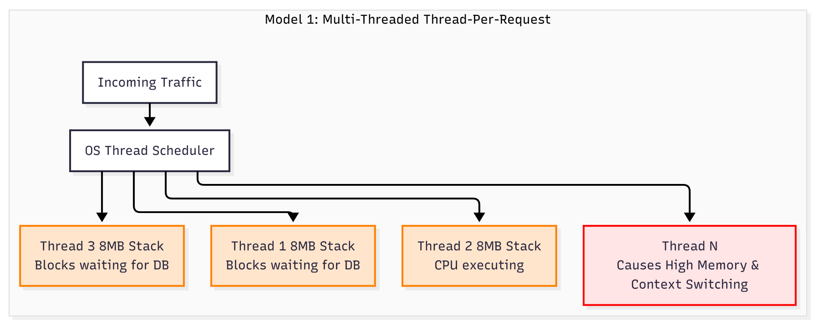
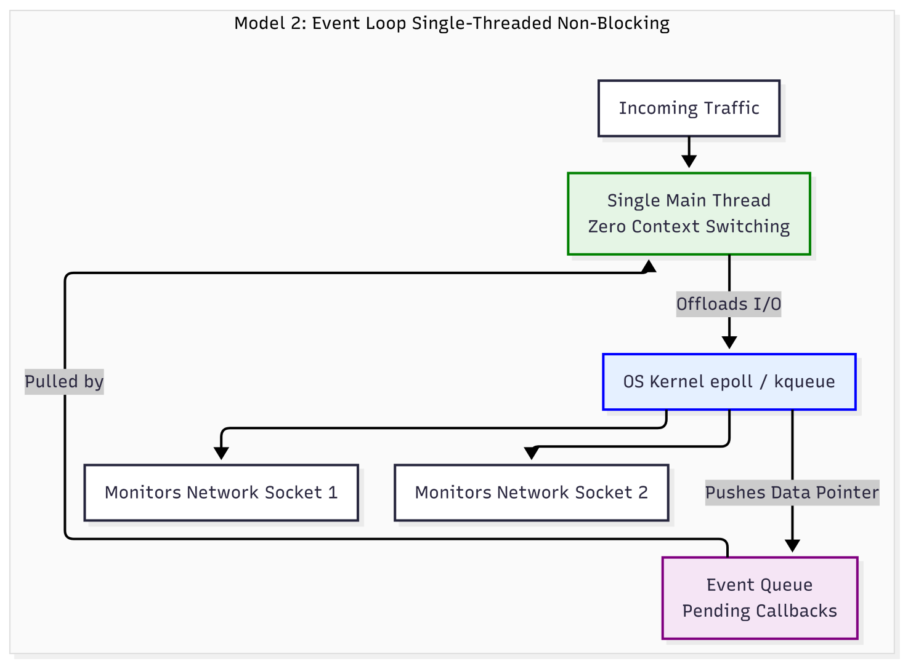

# 1.2 Threads, Concurrency & The Event Loop

### Setup Stage

To understand how a server handles thousands of requests at the exact same time, we must understand Concurrency. In this sub-phase, we will contrast two completely different architectural models: the Multi-Threaded model (historically used by Apache, Java, C++) and the Single-Threaded Event Loop model (used by Node.js, Nginx, Redis).

To demonstrate both, we will need our existing C++ compiler (`g++`) for the multi-threaded OS mechanics, and we will need to install Node.js to observe the Event Loop runtime mechanics.

Please open your WSL2 / Linux terminal and run the following commands to install Node.js using Node Version Manager (NVM), which is the industry standard for Linux environments:

```bash
# Install NVM (Node Version Manager)
curl -o- https://raw.githubusercontent.com/nvm-sh/nvm/v0.39.7/install.sh | bash

# Refresh your bash environment to use nvm immediately
source ~/.bashrc

# Install the latest stable Long Term Support (LTS) version of Node.js
nvm install --lts

# Verify the installation was successful
node --version
```

---

### Stage 1: Concept & Core Problem (Threads, Concurrency & The Event Loop)

Let us start from the absolute basics of how the CPU executes code and scales to handle multiple simultaneous tasks.

#### Step 1: Processes vs. Threads
In the previous sub-phase, we established that a **Process** is an executing program with its own isolated Virtual Memory (Stack, Heap, Code). 

A **Thread** is the actual active unit of execution *inside* that Process. 
When a process starts, the OS creates one "Main Thread". 
*   A Thread does not have its own Virtual Memory space. Instead, all threads inside a Process **share the exact same Heap and Text (Code) segments**. 
*   However, because each thread executes functions independently, the OS allocates **each Thread its own independent Stack**.

#### Step 2: The Physical CPU Constraint & Context Switching
A single physical CPU core can only execute instructions for **one thread at any exact nanosecond**. 
If you have 1 CPU core but 10 active threads, the OS Kernel uses a scheduler to fake simultaneous execution. It runs Thread 1 for a few milliseconds, pauses it, and switches to Thread 2.

This pause-and-switch is called a **Context Switch**. 
Mechanically, during a Context Switch, the CPU must:
1. Stop executing Thread 1.
2. Save Thread 1's current local state (its CPU registers and exact Stack Pointer memory address) into a kernel data structure.
3. Retrieve Thread 2's saved state from memory.
4. Load Thread 2's state into the hardware CPU registers.
5. Resume execution.

Context switching is a pure overhead operation. The CPU is spending compute cycles just swapping data, not actually processing your application logic.

#### Step 3: The Core Engineering Problem — I/O Blocking
The central problem in backend engineering is the massive speed difference between the CPU and external hardware (Network/Disk).

CPU instructions execute in nanoseconds. However, if a thread needs to read a file from the hard drive or wait for a database query over the network, it takes milliseconds (millions of nanoseconds). 

When a thread requests data over a network socket, the OS puts that thread to "sleep". This is called **Blocking I/O**. The thread literally sits idle, holding onto its allocated memory (its 8MB Stack), doing zero work until the network packet arrives.

#### Step 4: Architectural Solution 1 - The Multi-Threaded Model (Thread-Per-Request)
Historically (e.g., Apache Web Server, early Java/C++ servers), backends solved network blocking by throwing more threads at the problem.

1. A network request arrives. 
2. The server spawns a brand new Thread (allocating a fresh 8MB Stack) to handle it.
3. If the request needs database data, Thread 1 initiates the network call and **blocks** (sleeps).
4. Because Thread 1 is asleep, the OS performs a Context Switch and assigns the CPU to Thread 2 to handle the next incoming request.

**The Fatal Flaw (The C10K Problem):** 
What happens when 10,000 concurrent network requests arrive? 
The server spawns 10,000 threads. 
*   **Memory Exhaustion:** 10,000 threads * 8MB Stack per thread = 80 Gigabytes of RAM just for idle thread memory.
*   **Thread Thrashing:** The OS scheduler gets overwhelmed trying to Context Switch between 10,000 threads. The CPU spends 90% of its time swapping registers and 10% of its time actually processing data. The server crashes.

#### Step 5: Architectural Solution 2 - The Single-Threaded Event Loop
To handle massive scale, modern backends (Node.js, Nginx, Redis) fundamentally changed the architecture. They abandon the Thread-Per-Request model entirely.

Instead, they use **One Single Thread** to process all network traffic, relying on a mechanism called the **Event Loop**.
1. The server has only one Main Thread. It requires practically no memory overhead.
2. A network request arrives. The Main Thread reads it.
3. The request requires database data. Instead of blocking, the Main Thread issues a **Non-Blocking** system call to the OS kernel (e.g., `epoll` in Linux). It says: *"Kernel, monitor this network socket for data. Do not put me to sleep. I am moving on."*
4. The Main Thread immediately pivots to accept the next incoming network request. It never sleeps.
5. When the database data finally arrives over the wire, the hardware network card interrupts the OS. The OS places an "Event" (a memory pointer to the newly arrived data) into an **Event Queue**.
6. The Event Loop continuously spins. It checks the Event Queue, sees the new event, takes the data, and resumes executing the logic for the original request.

By never blocking, a single CPU core can handle tens of thousands of concurrent connections using almost zero RAM and incurring zero context-switching overhead.

#### Blocking and Non-Blocking Visual Diagram




---

### Stage 2: Technical Walkthrough (Threads, Concurrency & The Event Loop)

Let us examine exactly how the Single-Threaded Event Loop architecture operates inside a real runtime environment. We will look at **Node.js**, which consists of two core C++ engines working together: the **V8 Engine** (which compiles and executes JavaScript code) and **libuv** (which handles the Event Loop and asynchronous OS system calls).

We will trace the exact flow of memory and execution when a Node.js server receives a request, queries a database, and returns a response.

#### Step 1: The Runtime Memory Structures
When the Node.js process starts, it allocates specific memory structures on the Main Thread:
1.  **The Call Stack (Managed by V8):** A standard LIFO memory structure where synchronous function execution happens (just like we saw in C++).
2.  **The OS Thread Pool (Managed by libuv):** A small, pre-allocated pool of background threads used *strictly* for file system (Disk I/O) or heavy CPU cryptography. (Note: Network I/O does *not* use these threads; it uses the OS kernel directly).
3.  **The Task Queue (Memory Buffer):** A FIFO (First-In, First-Out) queue in memory where `libuv` places pointers to code that is ready to be executed.
4.  **The Event Loop:** A continuous C++ `while` loop that constantly checks if the Call Stack is empty and if the Task Queue has pending pointers.

#### Step 2: Synchronous Execution (The Call Stack)
A network request arrives. V8 pushes the `handleRequest()` function onto the **Call Stack**. The CPU begins executing the instructions inside this function synchronously. 
If there are mathematical calculations or variable assignments, the CPU executes them immediately, modifying data on the Stack and the Heap. During this exact microsecond, the Main Thread is entirely occupied. No other JavaScript code can run.

#### Step 3: Asynchronous Offloading (The Non-Blocking Call)
Inside `handleRequest()`, the code needs to query a database over the network via a TCP socket. 
1.  V8 pushes the `database.query(sql, callbackFn)` function onto the Call Stack.
2.  Instead of waiting for the database to respond, the V8 engine passes the SQL payload and a memory pointer to the `callbackFn` directly to the **libuv** engine.
3.  `libuv` executes a non-blocking System Call (`epoll` on Linux). It registers a file descriptor (the network socket) with the Linux Kernel and says: *"Monitor this socket. When data arrives, alert me."*
4.  Crucially, `libuv` immediately returns control to V8. 
5.  The CPU pops `database.query` off the Call Stack. The `handleRequest()` function completes, and its Stack Frame is destroyed. 
6.  The Main Thread is now completely empty and perfectly idle, ready to accept a brand new network request, even though the database has not responded yet.

#### Step 4: The OS Interrupt and The Task Queue
Milliseconds later, the database server sends the requested data back over the physical wire.
1.  The physical Network Interface Card (NIC) receives the electrical signals and writes the data into the OS Kernel's memory buffer.
2.  The OS Kernel triggers a hardware interrupt. It signals `epoll`, which informs `libuv` that the socket has data ready.
3.  `libuv` takes the data, pairs it with the memory pointer for the `callbackFn` we gave it earlier, and pushes this bundle into the **Task Queue**.

#### Step 5: The Event Loop's Tick
The Event Loop is constantly spinning on the Main Thread, executing a strict algorithmic check known as a "Tick":
1.  **Condition 1:** Is the V8 Call Stack currently empty? 
2.  **Condition 2:** Is there a pointer waiting in the Task Queue?

If the Main Thread is currently busy processing a different user's request, the Call Stack is *not* empty. The database response will simply wait patiently in the Task Queue. This is why CPU-heavy operations block the Event Loop—they prevent the Call Stack from emptying.

Once the Call Stack is fully empty, the Event Loop grabs the `callbackFn` pointer and the database payload from the Task Queue and pushes them onto the V8 Call Stack. The CPU resumes execution, processing the database data and finally sending the HTTP response back to the user.

--- 

### Stage 3: *Headover to src/ for code implementations*

---

### Stage 4: Code Breakdown (Threads, Concurrency & The Event Loop)

Here is the line-by-line breakdown mapping the code directly back to the architectural theory (Stage 1) and the system runtime mechanics (Stage 2).

#### 1. The Multi-Threaded Code Breakdown (`blocking_threads.cpp`)

```cpp
    for (int i = 1; i <= 3; i++) {
        threadPool.push_back(std::thread(handleRequestBlocking, i));
    }
```
*   **Architecture (Stage 1, Step 4):** This is the classic "Thread-Per-Request" model. For each of the 3 incoming requests, we issue a command to the OS to spawn a completely new execution Thread. 
*   **Mechanics (Stage 2):** When `std::thread` is called, the OS Kernel allocates three separate 8-Megabyte Stack memory segments. The OS Thread Scheduler registers three new active execution contexts that the physical CPU must now juggle.

```cpp
void handleRequestBlocking(int requestId) {
    std::cout << "[Thread " << std::this_thread::get_id() << "] Request " << requestId << " received..." << std::endl;
```
*   The `std::this_thread::get_id()` will print a unique memory identifier for each thread, proving that the execution is distributed across distinct memory spaces. 

```cpp
    std::this_thread::sleep_for(std::chrono::seconds(2));
```
*   **Architecture (Stage 1, Step 3):** This simulates **Blocking I/O** (e.g., waiting for a database to read from disk).
*   **Mechanics (Stage 2):** The thread makes a system call, and the OS physically removes the thread from the CPU's active processing queue. The thread is put to "sleep". However, its 8MB Stack remains fully allocated in RAM.
*   Because the thread is asleep, the OS performs a **Context Switch**. It saves the CPU registers for Thread 1 to memory, loads the registers for Thread 2, and allows Thread 2 to run until it *also* hits the block. If 10,000 requests hit this line, the OS scheduler would crash trying to Context Switch 10,000 sleeping threads.

#### 2. The Single-Threaded Code Breakdown (`event_loop.js`)

```javascript
for (let i = 1; i <= 3; i++) {
    handleRequestNonBlocking(i);
}
```
*   **Architecture (Stage 1, Step 5):** We have exactly One Main Thread. No new OS threads are spawned. Zero additional Stack memory is allocated by the OS.
*   **Mechanics (Stage 2, Step 2):** The V8 Engine pushes the `for` loop and the synchronous `handleRequestNonBlocking()` calls directly onto the **Call Stack**. The CPU executes them in microsecond sequence.

```javascript
    setTimeout(() => {
        console.log(`[Event Loop] I/O for Request ${requestId} finished. Executing callback.`);
    }, 2000);
```
*   **Mechanics (Stage 2, Step 3):** `setTimeout` simulates a network database query. Instead of pausing the CPU (blocking), the V8 engine takes the anonymous arrow function `() => {...}` and its memory pointer, and hands it off to the **libuv** engine.
*   `libuv` issues a non-blocking command to the OS Kernel to start a 2-second timer. 
*   Crucially, `setTimeout` completes its execution instantaneously. It pops off the V8 Call Stack immediately.

```javascript
console.log("[Main Thread] I am totally free to do other work...");
console.log("--- Main Call Stack is now empty ---");
```
*   **Architecture (Stage 1, Step 5):** Because the Main Thread never blocked, the CPU instantly proceeds to these lines and executes them. The output terminal will print these lines *before* any of the 2-second I/O callbacks finish.
*   **Mechanics (Stage 2, Step 5):** Once this final `console.log` finishes, the V8 **Call Stack is completely empty**. The Main Thread sits idle. The C++ **Event Loop** is now continuously spinning, waiting for the OS.

*(2 Seconds Later)*
*   **Mechanics (Stage 2, Step 4 & 5):** The OS Kernel timer finishes. The OS sends a hardware interrupt to `libuv`. 
*   `libuv` takes the 3 memory pointers for our arrow functions and pushes them into the **Task Queue**.
*   The spinning Event Loop checks its conditions: *Is the Call Stack empty?* Yes. *Is there a pointer in the Task Queue?* Yes. 
*   The Event Loop pops the pointer from the Task Queue, pushes the arrow function back onto the V8 Call Stack, and the CPU executes the final `console.log` for the completed request.

***
***
