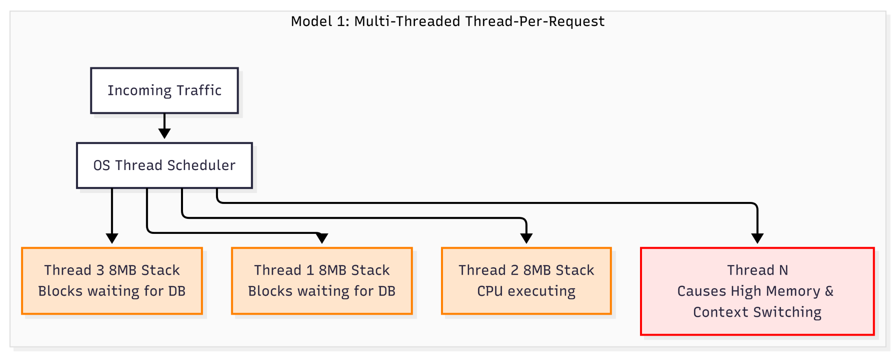
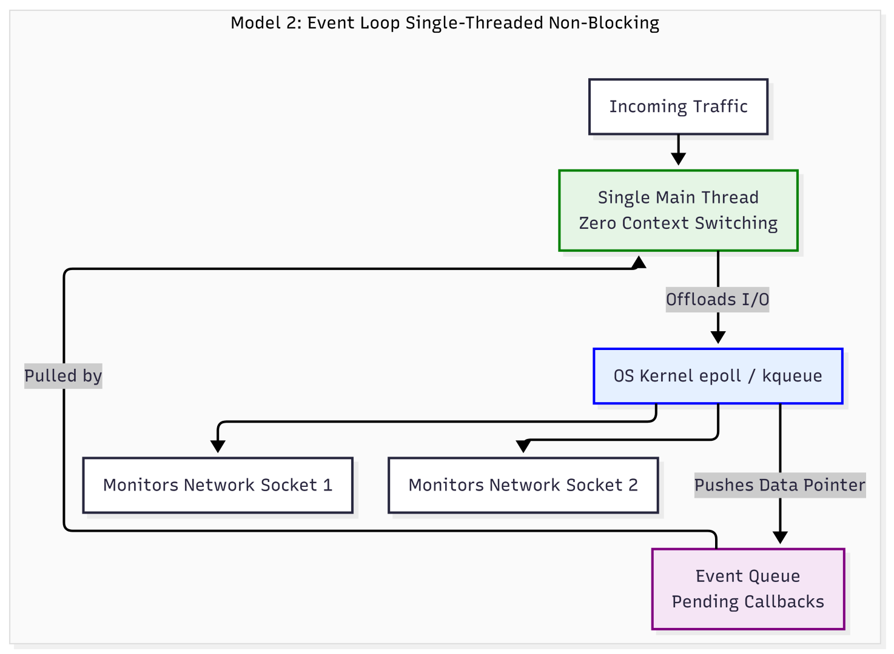
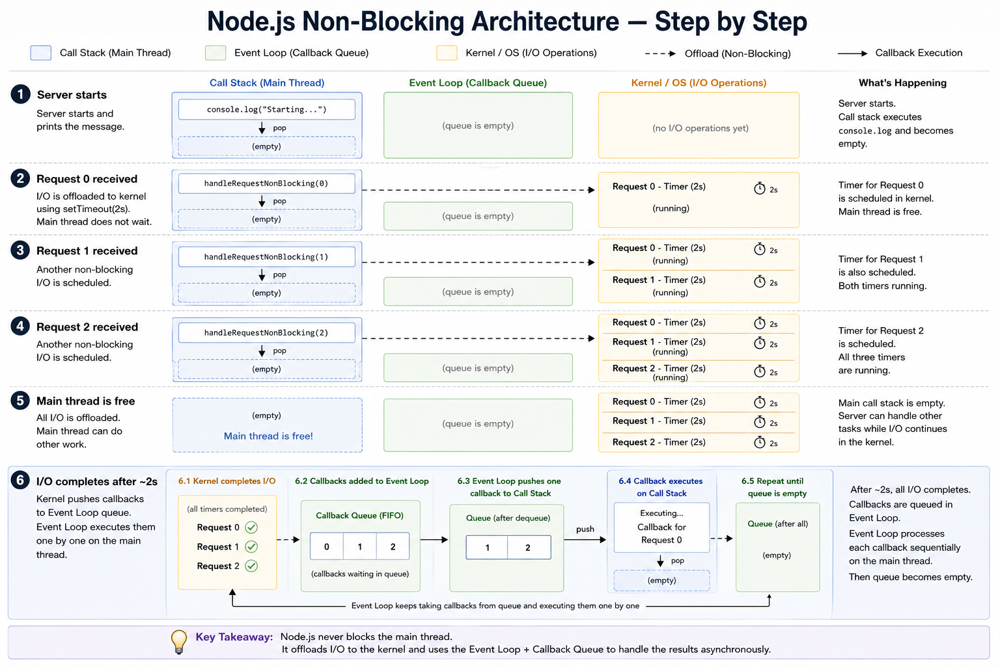

# 1.2 Threads, Concurrency & The Event Loop

### Setup Stage

To understand how a server handles thousands of requests at the exact same time, we must understand Concurrency. In this sub-phase, we will contrast two completely different architectural models: the Multi-Threaded model (historically used by Apache, Java, C++) and the Single-Threaded Event Loop model (used by Node.js, Nginx, Redis).

To demonstrate both, we will need our existing C++ compiler (`g++`) for the multi-threaded OS mechanics, and we will need to install Node.js to observe the Event Loop runtime mechanics.

Please open your WSL2 / Linux terminal and run the following commands to install Node.js using Node Version Manager (NVM), which is the industry standard for Linux environments:

```bash
# Install NVM (Node Version Manager)
curl -o- https://raw.githubusercontent.com/nvm-sh/nvm/v0.39.7/install.sh | bash

# Refresh your bash environment to use nvm immediately
source ~/.bashrc

# Install the latest stable Long Term Support (LTS) version of Node.js
nvm install --lts

# Verify the installation was successful
node --version
```

---

### Stage 1: Concept & Core Problem (Threads, Concurrency & The Event Loop)

Let us start from the absolute basics of how the CPU executes code and scales to handle multiple simultaneous tasks.

#### Step 1: Processes vs. Threads

In the previous sub-phase, we established that a **Process** is an executing program with its own isolated Virtual Memory (Stack, Heap, Code).

A **Thread** is the actual active unit of execution *inside* that Process.
When a process starts, the OS creates one "Main Thread".

* A Thread does not have its own Virtual Memory space. Instead, all threads inside a Process **share the exact same Heap and Text (Code) segments**.
* However, because each thread executes functions independently, the OS allocates **each Thread its own independent Stack**.

#### Step 2: The Physical CPU Constraint & Context Switching

A single physical CPU core can only execute instructions for **one thread at any exact nanosecond**.
If you have 1 CPU core but 10 active threads, the OS Kernel uses a scheduler to fake simultaneous execution. It runs Thread 1 for a few milliseconds, pauses it, and switches to Thread 2.

This pause-and-switch is called a **Context Switch**.
Mechanically, during a Context Switch, the CPU must:

1. Stop executing Thread 1.
2. Save Thread 1's current local state (its CPU registers and exact Stack Pointer memory address) into a kernel data structure.
3. Retrieve Thread 2's saved state from memory.
4. Load Thread 2's state into the hardware CPU registers.
5. Resume execution.

Context switching is a pure overhead operation. The CPU is spending compute cycles just swapping data, not actually processing your application logic.

#### Step 3: The Core Engineering Problem — I/O Blocking

The central problem in backend engineering is the massive speed difference between the CPU and external hardware (Network/Disk).

CPU instructions execute in nanoseconds. However, if a thread needs to read a file from the hard drive or wait for a database query over the network, it takes milliseconds (millions of nanoseconds).

When a thread requests data over a network socket, the OS puts that thread to "sleep". This is called **Blocking I/O**. The thread literally sits idle, holding onto its allocated memory (its 8MB Stack), doing zero work until the network packet arrives.

#### Step 4: Architectural Solution 1 - The Multi-Threaded Model (Thread-Per-Request)

Historically (e.g., Apache Web Server, early Java/C++ servers), backends solved network blocking by throwing more threads at the problem.

1. A network request arrives.
2. The server spawns a brand new Thread (allocating a fresh 8MB Stack) to handle it.
3. If the request needs database data, Thread 1 initiates the network call and **blocks** (sleeps).
4. Because Thread 1 is asleep, the OS performs a Context Switch and assigns the CPU to Thread 2 to handle the next incoming request.

**The Fatal Flaw (The C10K Problem):**
What happens when 10,000 concurrent network requests arrive?
The server spawns 10,000 threads.

* **Memory Exhaustion:** 10,000 threads * 8MB Stack per thread = 80 Gigabytes of RAM just for idle thread memory.
* **Thread Thrashing:** The OS scheduler gets overwhelmed trying to Context Switch between 10,000 threads. The CPU spends 90% of its time swapping registers and 10% of its time actually processing data. The server crashes.

#### Step 5: Architectural Solution 2 - The Single-Threaded Event Loop

To handle massive scale, modern backends (Node.js, Nginx, Redis) fundamentally changed the architecture. They abandon the Thread-Per-Request model entirely.

Instead, they use **One Single Thread** to process all network traffic, relying on a mechanism called the **Event Loop**.

1. The server has only one Main Thread. It requires practically no memory overhead.
2. A network request arrives. The Main Thread reads it.
3. The request requires database data. Instead of blocking, the Main Thread issues a **Non-Blocking** system call to the OS kernel (e.g., `epoll` in Linux). It says: *"Kernel, monitor this network socket for data. Do not put me to sleep. I am moving on."*
4. The Main Thread immediately pivots to accept the next incoming network request. It never sleeps.
5. When the database data finally arrives over the wire, the hardware network card interrupts the OS. The OS places an "Event" (a memory pointer to the newly arrived data) into an **Event Queue**.
6. The Event Loop continuously spins. It checks the Event Queue, sees the new event, takes the data, and resumes executing the logic for the original request.

By never blocking, a single CPU core can handle tens of thousands of concurrent connections using almost zero RAM and incurring zero context-switching overhead.

#### Blocking and Non-Blocking Visual Diagram




---

### Stage 2: Technical Walkthrough (Threads, Concurrency & The Event Loop)

Let us examine exactly how the Single-Threaded Event Loop architecture operates inside a real runtime environment. We will look at **Node.js**, which consists of two core C++ engines working together: the **V8 Engine** (which compiles and executes JavaScript code) and **libuv** (which handles the Event Loop and asynchronous OS system calls).

We will trace the exact flow of memory and execution when a Node.js server receives a request, queries a database, and returns a response.

#### Step 1: The Runtime Memory Structures

When the Node.js process starts, it allocates specific memory structures on the Main Thread:

1. **The Call Stack (Managed by V8):** A standard LIFO memory structure where synchronous function execution happens (just like we saw in C++).
2. **The OS Thread Pool (Managed by libuv):** A small, pre-allocated pool of background threads used *strictly* for file system (Disk I/O) or heavy CPU cryptography. (Note: Network I/O does *not* use these threads; it uses the OS kernel directly).
3. **The Task Queue (Memory Buffer):** A FIFO (First-In, First-Out) queue in memory where `libuv` places pointers to code that is ready to be executed.
4. **The Event Loop:** A continuous C++ `while` loop that constantly checks if the Call Stack is empty and if the Task Queue has pending pointers.

#### Step 2: Synchronous Execution (The Call Stack)

A network request arrives. V8 pushes the `handleRequest()` function onto the **Call Stack**. The CPU begins executing the instructions inside this function synchronously.
If there are mathematical calculations or variable assignments, the CPU executes them immediately, modifying data on the Stack and the Heap. During this exact microsecond, the Main Thread is entirely occupied. No other JavaScript code can run.

#### Step 3: Asynchronous Offloading (The Non-Blocking Call)

Inside `handleRequest()`, the code needs to query a database over the network via a TCP socket.

1. V8 pushes the `database.query(sql, callbackFn)` function onto the Call Stack.
2. Instead of waiting for the database to respond, the V8 engine passes the SQL payload and a memory pointer to the `callbackFn` directly to the **libuv** engine.
3. `libuv` executes a non-blocking System Call (`epoll` on Linux). It registers a file descriptor (the network socket) with the Linux Kernel and says: *"Monitor this socket. When data arrives, alert me."*
4. Crucially, `libuv` immediately returns control to V8.
5. The CPU pops `database.query` off the Call Stack. The `handleRequest()` function completes, and its Stack Frame is destroyed.
6. The Main Thread is now completely empty and perfectly idle, ready to accept a brand new network request, even though the database has not responded yet.

#### Step 4: The OS Interrupt and The Task Queue

Milliseconds later, the database server sends the requested data back over the physical wire.

1. The physical Network Interface Card (NIC) receives the electrical signals and writes the data into the OS Kernel's memory buffer.
2. The OS Kernel triggers a hardware interrupt. It signals `epoll`, which informs `libuv` that the socket has data ready.
3. `libuv` takes the data, pairs it with the memory pointer for the `callbackFn` we gave it earlier, and pushes this bundle into the **Task Queue**.

#### Step 5: The Event Loop's Tick

The Event Loop is constantly spinning on the Main Thread, executing a strict algorithmic check known as a "Tick":

1. **Condition 1:** Is the V8 Call Stack currently empty?
2. **Condition 2:** Is there a pointer waiting in the Task Queue?

If the Main Thread is currently busy processing a different user's request, the Call Stack is *not* empty. The database response will simply wait patiently in the Task Queue. This is why CPU-heavy operations block the Event Loop—they prevent the Call Stack from emptying.

Once the Call Stack is fully empty, the Event Loop grabs the `callbackFn` pointer and the database payload from the Task Queue and pushes them onto the V8 Call Stack. The CPU resumes execution, processing the database data and finally sending the HTTP response back to the user.

---

### Stage 3: *Headover to src/ for code implementations*

---

### Stage 4: Code Breakdown (Part 1 - The Multi-Threaded Model in C++)

Here is the line-by-line breakdown of the C++ code, explaining the syntax and mapping it directly back to the architectural theory (Stage 1) and system runtime mechanics (Stage 2).

#### The Standard Library Imports

```cpp
#include <iostream>
#include <thread>
#include <chrono>
#include <vector>
```

* **Syntax:** C++ relies on external libraries for advanced system capabilities. `<thread>` imports the OS-level threading API, allowing us to ask the Linux kernel to spawn hardware threads. `<vector>` is a dynamic array (stored on the Heap) used to keep track of these thread objects. `<chrono>` gives us access to precise CPU clock cycles and time.

#### Simulating Concurrent Requests & Thread Spawning

```cpp
int main() {
    std::vector<std::thread> threadPool;

    for (int i = 1; i <= 3; i++) {
        threadPool.push_back(std::thread(handleRequestBlocking, i));
    }
```

* **Syntax:** We create a loop that runs 3 times, simulating 3 simultaneous network requests arriving at the server. `std::thread(functionName, argument)` instructs the C++ runtime to spawn a new thread and immediately start executing `handleRequestBlocking(i)` on that thread. We push the reference of this thread into our `threadPool` array so we don't lose it.
* **Architecture (Stage 1 - Step 4: Thread-Per-Request):** This is the exact Multi-Threaded architectural model. Because we know the upcoming task will block the CPU, we *cannot* execute it on the Main Thread. If we did, Request 2 could not be processed until Request 1 finished. Therefore, we literally throw hardware resources at the problem by spawning a brand new OS Thread for each request.
* **Mechanics (Stage 2 - Step 1 & 2):** When `std::thread` executes, the Linux OS performs a heavy operation. It creates three new execution units. Crucially, the OS allocates three separate, isolated Virtual Memory Stack Segments (typically 8MB each) in RAM. The CPU is now forced to perform **Context Switches** to juggle execution between the Main Thread and Threads 1, 2, and 3.

#### The Blocking I/O Operation

```cpp
void handleRequestBlocking(int requestId) {
    std::cout << "[Thread " << std::this_thread::get_id() << "] Request " << requestId << " received..." << std::endl;
```

* **Syntax:** `std::this_thread::get_id()` asks the OS to print the unique hardware identifier for the thread currently executing this code. If you look at your terminal output, you will see 3 completely different, randomized IDs, proving that parallel OS threads are at work.

```cpp
    std::this_thread::sleep_for(std::chrono::seconds(2));
```

* **Architecture (Stage 1 - Step 3: The I/O Blocking Problem):** This line simulates a 2-second database query or disk read. During this time, the thread is completely blocked. It does absolutely zero compute work. However, the thread is still alive, aggressively holding onto its 8MB Stack Memory. If we scaled this loop from 3 to 10,000, we would instantly consume 80 Gigabytes of RAM for threads that are literally just sleeping.
* **Mechanics (Stage 2):** When the CPU hits `sleep_for` (or a blocking network socket read), it triggers a system interrupt. The OS Kernel steps in and marks this thread's state as "WAITING". The OS Scheduler forcibly evicts the thread from the physical CPU core. It saves the thread's Stack Pointer and CPU registers into Kernel memory, and loads the registers for the next thread. This Context Switching overhead burns CPU cycles just swapping data around.

#### Reclaiming the Threads

```cpp
    for (auto& t : threadPool) {
        t.join();
    }
```

* **Syntax:** A `for` loop that iterates over our dynamic array of threads. `t.join()` explicitly tells the Main Thread: *"Pause your execution here. Do not exit the program until the OS confirms that this specific worker thread has finished its execution."*
* **Mechanics:** Once a worker thread completes its function, the OS destroys its 8MB Stack, reclaims the memory, and signals the `join()` command to proceed. The Main Thread cleans up all 3 threads and gracefully exits.

---

### Stage 4: Code Breakdown (Part 2 - The Single-Threaded Event Loop in Node.js)

Here is the line-by-line breakdown of the JavaScript code, highlighting the mechanics of Asynchronous I/O and mapping it back to the architectural theory (Stage 1) and system runtime mechanics (Stage 2).

#### The Synchronous Main Thread Execution

```javascript
for (let i = 1; i <= 3; i++) {
    handleRequestNonBlocking(i);
}
```

* **Architecture (Stage 1 - Step 5: The Single-Threaded Event Loop):** Unlike the C++ code, we do *not* ask the OS to spawn new threads. There is only one Main Thread. The V8 engine simply loops three times, pushing the `handleRequestNonBlocking` function onto the Call Stack sequentially.
* **Memory Efficiency:** Because there are no new OS threads created, there are no new 8MB Stack memory segments allocated. Memory usage remains flat, and the CPU performs zero context switches.

#### The Asynchronous I/O Offload (The Non-Blocking Call)

```javascript
function handleRequestNonBlocking(requestId) {
    console.log(`[Main Thread] Request ${requestId} received. Offloading I/O to OS Kernel...`);

    setTimeout(() => {
        console.log(`[Event Loop] I/O for Request ${requestId} finished. Executing callback.`);
    }, 2000);
}
```

* **Syntax:** `setTimeout(callbackFn, delay)` is used here to simulate a 2-second database query over a network.
* **Mechanics (Stage 2 - Step 3: Asynchronous Offloading):** This is the most critical mechanic in Node.js. `setTimeout` (or a database network call) is *not* a JavaScript engine feature. It is a bridge to the C++ **libuv** engine.
* When the V8 engine hits `setTimeout`, it does **not** put the thread to sleep (like C++ `sleep_for`). Instead, V8 hands the anonymous arrow function `() => { ... }` (a memory pointer) and the 2000ms instruction directly to `libuv`.
* `libuv` sets up a timer via OS-level APIs (similar to registering a network socket via `epoll`).
* V8 instantly pops `handleRequestNonBlocking` off the Call Stack. The execution took nanoseconds, and the CPU moves immediately back to the `for` loop to process the next request.

#### The Empty Call Stack

```javascript
console.log("[Main Thread] I am totally free to do other work while the database queries are running!");
console.log("--- Main Call Stack is now empty ---");
```

* **Mechanics (Stage 2 - Step 2):** Look at your terminal output when you ran `node event_loop.js`. You saw all the "[Main Thread]" logs print *instantly*, completely ignoring the 2-second delay.
* This proves the Main Thread never blocked. The V8 engine blasted through the `for` loop, offloaded all three "database queries" to `libuv`, printed these final console logs, and emptied the **Call Stack**.

#### The Event Loop Tick and Task Queue (2 Seconds Later)

```javascript
    () => {
        console.log(`[Event Loop] I/O for Request ${requestId} finished. Executing callback.`);
    }
```

* **Mechanics (Stage 2 - Steps 4 & 5):** Exactly 2 seconds later, the OS signals `libuv` that the timers (or our simulated database queries) have finished.
* `libuv` takes the three memory pointers to our callback functions and pushes them into the **Task Queue**.
* The **Event Loop**, which has been spinning infinitely in the background, checks its two conditions:
    1. *Is the V8 Call Stack empty?* Yes, we finished running all our synchronous code.
    2. *Is there something in the Task Queue?* Yes, the three callback pointers.
* The Event Loop pulls the first callback pointer from the Task Queue and pushes it onto the V8 Call Stack. The CPU executes it, printing the final `[Event Loop]` message. It repeats this for the remaining two callbacks.
* Once the Task Queue is empty and no more OS events are registered, the Node.js process gracefully exits.



***

### Doubt Clearance and Q/A

> **Q1. I would like to know about concurrency vs parallelism and under which category the even loop architecture would NodeJS fall?**

**Answer:**

This is an excellent conceptual question. The terms "Concurrency" and "Parallelism" are often mistakenly used interchangeably, but in computer science, they describe two fundamentally different mechanical realities regarding how the CPU and OS handle instructions.

Here is the technical breakdown of the two, and exactly where Node.js fits.

#### 1. Parallelism (A Hardware Property)

Parallelism is strictly about **simultaneous execution**. It means multiple CPU instructions are being processed at the *exact same physical nanosecond*.

For parallelism to exist, you absolutely must have **multiple physical CPU cores** (or multiple physical machines).

* **The Mechanics:** If you have an 8-core CPU, the Operating System can assign Thread 1 to Core A, and Thread 2 to Core B.
* During a specific CPU clock cycle, Core A processes an instruction for Thread 1, and Core B simultaneously processes an instruction for Thread 2.
* This is true simultaneous compute.

#### 2. Concurrency (A Software / Scheduling Property)

Concurrency is about **overlapping task lifespans**. It means the system is managing and making progress on multiple tasks at the same time, but they do *not* have to execute simultaneously.

Concurrency can occur on a **single CPU core**.

* **The Mechanics (Multi-Threaded):** As we saw in C++, the OS uses Context Switching. Core A executes Thread 1 for 10 milliseconds, pauses it, and executes Thread 2 for 10 milliseconds. Over the span of a full second, both threads made progress. They were handled *concurrently*, but never *in parallel* (because only one instruction executed per clock cycle).
* **The Mechanics (Event Loop):** The application begins Request 1, offloads the heavy I/O to the kernel, and immediately begins Request 2. The lifespans of processing Request 1 and Request 2 overlap, meaning the system is concurrent.

*Summary distinction:* Concurrency is about **dealing** with a lot of things at once. Parallelism is about **doing** a lot of things at once.

#### Where does the Node.js Event Loop fall?

The Node.js Event Loop architecture is strictly a **Concurrency** model, not a Parallelism model.

Here is why:

1. **The Single Thread Rule:** The V8 engine (which executes your JavaScript code) runs on exactly one Main Thread.
2. **No Simultaneous Execution:** Because there is only one Call Stack on one thread, the CPU can only ever execute one single line of your JavaScript code at any exact physical microsecond. If you write a massive `while` loop that takes 10 seconds to calculate prime numbers, it will completely block the Main Thread, and no other concurrent requests can be processed.

Node.js achieves massive scale through highly efficient **Concurrency** via Asynchronous I/O. By offloading network waiting to the OS kernel, the single thread is free to rapidly interleave the execution of thousands of different user requests.

##### The One Exception (Hidden Parallelism in Node.js)

To be perfectly accurate about the runtime architecture: while your JavaScript code strictly runs concurrently on a single thread, the hidden **libuv** engine in Node.js *does* utilize hardware Parallelism under the hood for specific tasks.

As mentioned in Stage 2, `libuv` maintains a pre-allocated OS Thread Pool (defaulting to 4 hardware threads).
The OS Kernel handles network sockets via non-blocking `epoll`, but file system reads (Disk I/O) and cryptography (like hashing a password) do not support `epoll` efficiently.

When you ask Node.js to read a file from the hard drive or hash a password, `libuv` pushes that task to its internal Thread Pool. If your physical server has multiple CPU cores, the OS will execute those `libuv` background threads in true **Parallelism**, while your Main Thread continues handling network requests **Concurrently**.

</br>

> **Q2. Can you explain callback functions in javascript and about the function body as which we are calling and passing an anonymous function. Then, explain how callback functions help in asynchronous operations in general (because I have seen this in many modern programming languages but never fully understood).**

**Answer:**

This is a crucial fundamental concept to grasp. To understand callbacks, we must strip away the high-level syntax of modern languages and look at what a function actually is at the memory level.

Because this is a Q/A stage, I will answer this directly and extensively without the 4-stage format.

#### 1. What is a Callback Function? (The Memory Perspective)

In programming, a function is not magic—it is simply a block of compiled CPU instructions sitting somewhere in memory.

In modern languages like JavaScript, Python, or Go, functions are treated as **"First-Class Citizens."** This means the language engine treats a function exactly the same way it treats an integer or a string.

* When you create a function, the engine stores its machine instructions in a specific block of memory.
* The name of the function is simply a **variable holding a pointer** (the memory address) to that block of instructions.

A **Callback Function** is simply what happens when you take the memory pointer of *Function A* and pass it as an argument into *Function B*.
You are telling Function B: *"Here is the memory address of some code. Go do your work, and when you are ready, use this address to execute my code."*

#### 2. Anonymous Functions and the Syntax

Let us look at the code we used in the previous stage:

```javascript
setTimeout(() => {
    console.log(`[Event Loop] I/O finished.`);
}, 2000);
```

**Why do we use an anonymous function `() => { ... }` here?**
An anonymous function is simply a function that is created on the fly without assigning its memory pointer to a named variable.

Mechanically, when the CPU evaluates this line of code:

1. It allocates a small block of memory in the Heap to store the `console.log` instruction.
2. It generates a pointer (e.g., `0x55F1B2`) to that exact block of memory.
3. Instead of saving `0x55F1B2` to a variable (like `const myFunc = ...`), it immediately pushes `0x55F1B2` directly onto the Call Stack as the first argument for the `setTimeout` function.

We use anonymous functions strictly for convenience. We only need this specific block of code to execute once, specifically when this timer finishes. There is no need to pollute our application's memory space with named variables for code we will never reference again.

#### 3. How Callbacks Enable Asynchronous Operations

Now, let us map exactly how passing these function pointers allows asynchronous (non-blocking) systems to operate.

The fundamental problem of asynchronous I/O is **resumption**. If the Main Thread fires off a database query and immediately moves on to process other users, how does the system know what to do when the database data finally arrives 2 seconds later?

Callbacks are the mechanical bridge that solves this. Here is the exact lifecycle:

##### Step 1: The Handoff

When you call an asynchronous function (like reading a file or querying a database), you are invoking a C++ API provided by the runtime (like `libuv`).
You pass two things into this API:

1. The parameters for the task (e.g., the SQL string).
2. The **Callback Pointer** (the memory address of the anonymous function you wrote to handle the result).

##### Step 2: The Storage (Closure)

The `libuv` engine takes your Callback Pointer and stores it safely in its own internal memory structures (often a C++ struct).
Because the engine holds this pointer, the JavaScript Garbage Collector knows *not* to delete your anonymous function from the Heap, even though the Main Thread has completely moved on.

##### Step 3: Offloading to the OS

The runtime sends the SQL string over the network socket and tells the OS kernel (via `epoll`) to monitor that socket. The Main Thread is now completely free to process other tasks.

##### Step 4: The Hardware Interrupt & Task Queue

The network packet arrives from the database. The hardware interrupts the OS, and the OS alerts `libuv`.
`libuv` retrieves the network payload from the OS buffer. It then looks up its internal structs and finds the **Callback Pointer** that was paired with this specific database query.
It bundles the database payload and the Callback Pointer together, and pushes them into the **Task Queue**.

##### Step 5: The Resumption (Executing the Callback)

The Event Loop, spinning on the Main Thread, sees an item in the Task Queue.
It pulls the Callback Pointer (`0x55F1B2`). It pushes that memory address onto the V8 Call Stack, passing the database payload as an argument.
The CPU jumps to `0x55F1B2` in memory, begins executing your `console.log` (or your data processing logic), and the asynchronous operation is officially complete.

**Summary:**
Without callback pointers, asynchronous programming would be impossible. The background system (the OS or libuv) has no idea what your application logic is supposed to do with the data. By handing the background system a memory address (the callback), you give it the exact coordinate to jump back into your specific application logic the moment the hardware task completes.

<br/>

> **Q3. Can you elaborate on callback functions? Because it is not only used with database requests or non-blocking systems. Can you explain how it is used generally with examples, and what is a callback hell with example?**

**Answer:**

To understand callbacks generally, we must separate them from the concept of "Asynchronous I/O". A callback function is fundamentally just a **memory pointer to a block of executable instructions** passed as an argument to another function.

How and when the receiving function decides to execute that pointer determines whether the callback is synchronous or asynchronous.

##### 1. Synchronous Callbacks (General Use)

In general programming, callbacks are heavily used to inject custom logic into pre-written algorithms. You see this most often in array manipulations (like `map`, `filter`, `sort`).

When a callback is synchronous, it has absolutely nothing to do with `libuv`, the Task Queue, or the OS Kernel. The CPU executes the callback immediately on the current Call Stack.

**Example: Array Filtering**

```javascript
const numbers = [10, 15, 20, 25];

// The anonymous function (num => num > 18) is a callback pointer
const largeNumbers = numbers.filter((num) => {
    return num > 18;
});
```

**The Mechanics:**

1. The V8 engine allocates memory for the `numbers` array on the Heap.
2. It pushes the native `filter` function onto the **Call Stack**.
3. Inside the compiled C++ code for `filter`, there is a `for` loop iterating over the array.
4. For the first element (`10`), the CPU takes the memory pointer of your anonymous callback function and pushes it onto the top of the Call Stack.
5. The CPU executes the callback, returns `false`, and pops the callback off the stack.
6. It repeats this for `15`, `20`, and `25`.
7. Once the loop finishes, the `filter` function is popped off the Call Stack.

**Why use a callback here?**
The engineers who wrote the V8 JavaScript engine do not know what specific mathematical condition you want to filter by. Instead of writing a thousand different functions (`filterGreaterThan`, `filterEvenNumbers`), they write one `filter` function that accepts a **memory pointer**. You pass in the pointer to your custom logic, and their engine executes it. This is purely synchronous, blocking CPU execution.

#### 2. What is Callback Hell?

Callback Hell (often called the "Pyramid of Doom") is an architectural anti-pattern that occurs in asynchronous programming when you have **multiple dependent I/O operations that must execute sequentially**.

Because asynchronous functions immediately pop off the Call Stack and return control to the Main Thread, you cannot write asynchronous code top-to-bottom. If Operation B requires data from Operation A, Operation B's code *must* physically reside inside Operation A's callback function pointer.

**Example of Callback Hell:**
Imagine a server needs to:

1. Query a database for a user.
2. Use that user's ID to query for their orders.
3. Write those orders to a file on the disk.
4. Send a network response confirming completion.

```javascript
// Step 1: Network I/O
db.query("SELECT * FROM users WHERE username='admin'", (err, user) => {
    
    // Step 2: Network I/O (Depends on Step 1)
    db.query(`SELECT * FROM orders WHERE user_id=${user.id}`, (err, orders) => {
        
        // Step 3: Disk I/O (Depends on Step 2)
        fs.writeFile("report.txt", orders.toString(), (err) => {
            
            // Step 4: Network I/O (Depends on Step 3)
            httpResponse.send("Report Generated!");
            
        });
    });
});
```

##### The Mechanical Execution & The Memory Problem

Let us trace exactly how V8 and memory handle this nested structure:

1. **First Execution:** The CPU pushes the outer `db.query` to the Call Stack. V8 hands the SQL string and the **Outer Callback Pointer** to `libuv`. The Call Stack instantly empties.
2. **First Resumption:** Milliseconds later, the database responds. The Event Loop pushes the Outer Callback Pointer to the Call Stack. The CPU executes it.
3. **Second Execution:** Inside that execution, the CPU hits the inner `db.query`. It hands the new SQL string and the **Inner Callback Pointer** to `libuv`. The Call Stack empties again.

While this works, it introduces two severe problems at the compiler and memory level:

**1. The Closure Memory Leak Threat:**
When a function is defined inside another function, it creates a **Closure**. At the memory level, the innermost functions maintain references to the variables declared in their outer parent functions.

* When Step 1 finishes, the `user` object is loaded into the Heap.
* Normally, when a function pops off the Call Stack, its local variables are destroyed.
* However, because Step 3's callback is nested inside Step 2, and Step 2 inside Step 1, the JavaScript Garbage Collector is paralyzed. It sees that the innermost function *might* need access to the `user` object later.
* Therefore, all data (`user`, `orders`, `err`) is forced to stay alive on the Heap until the absolute deepest callback finally finishes executing. In highly concurrent systems, this nested scoping severely bloats Heap memory usage.

**2. Instruction Locality (CPU Caching):**
Modern CPUs pre-fetch instructions into L1/L2 hardware caches assuming code executes linearly. Deeply nested callbacks force the CPU to constantly jump between wildly different memory addresses in the text segment (code segment) as it executes a few lines, offloads to the OS, empties the stack, and later jumps back into a nested pointer. This horizontal nesting destroys code readability for humans and optimizes poorly for CPU instruction caching.

*(Note: Modern languages solved Callback Hell by introducing `Promises` and `async/await`. These syntax features allow developers to write asynchronous code that looks linear, while the compiler secretly handles the callback pointers and state machines under the hood. We will strictly use `Promises`/`async` in future backend phases).*

<br/>

> **Q4. Can you give a sample definition of the filter function that shows how it works with the callback function? Like array.filter() is just the caller that takes a memory pointer as an argument, but if it returns false, where does the control return to, and where is the caller of the callback function (even in the database query code)? I am having a hard time visualizing the flow.**

**Answer:**

To visualize the flow, we must look at the **Call Stack**. The Call Stack is literally a stack of memory blocks. When a function calls another function, the CPU stacks the new block on top. When a function hits `return`, its block is destroyed, and the CPU resumes executing the block immediately beneath it.

#### Part 1: The Synchronous Flow (How `filter` works)

If we were to write the native JavaScript `.filter()` method from scratch, the engine-level code looks exactly like this:

```javascript
// The caller function sitting in memory
function customFilter(array, callbackPointer) {
    const resultingArray = []; // Allocated on the Heap

    for (let i = 0; i < array.length; i++) {
        
        // --- THE INVOCATION ---
        // The CPU jumps to the memory address stored in 'callbackPointer'.
        // It passes array[i] as the argument.
        const conditionResult = callbackPointer(array[i]); 
        
        // --- THE RESUMPTION ---
        // When the callback hits 'return', control comes exactly back to here.
        if (conditionResult === true) {
            resultingArray.push(array[i]);
        }
    }

    return resultingArray; // Pops customFilter off the stack
}

// The execution
const numbers = [10, 20];
const bigNumbers = customFilter(numbers, (num) => { 
    return num > 15; 
});
```

Code implementation in src/ as well

**Step-by-Step Call Stack Visualization:**

1. **Base State:** The Main Thread calls `customFilter`. The CPU creates a Stack Frame for `customFilter`.
2. **Loop Iteration 1 (num = 10):**
    * The CPU reads `callbackPointer(10)`.
    * It creates a **new** Stack Frame for your anonymous function and pushes it *on top* of the `customFilter` frame.
    * The CPU executes `10 > 15`. The result is `false`.
    * The anonymous function executes `return false`.
    * **Where does control return?** The CPU destroys the top Stack Frame (the callback). It looks at the frame immediately below it (`customFilter`). It resumes execution exactly where it left off, assigning `false` to the `conditionResult` variable.
    * The `if` block is skipped.
3. **Loop Iteration 2 (num = 20):**
    * The CPU pushes the callback frame on top again.
    * `20 > 15` is `true`. `return true` executes.
    * The callback frame is destroyed. Control drops back to `customFilter`. `conditionResult` becomes `true`.
    * `20` is pushed to the Heap array.

In synchronous code, the caller is always the function physically wrapping the invocation (`customFilter`), and it waits on the Call Stack for the callback to finish.

#### Part 2: The Asynchronous Flow (Who calls the database callback?)

This is where visualization gets tricky, because your intuition tells you that `db.query()` is the caller. **It is not.**

In asynchronous programming, `db.query()` *never* calls your callback. `db.query()` is just a setup function.

Let us look at a simplified conceptual implementation of `db.query`:

```javascript
function dbQuery(sqlString, callbackPointer) {
    // 1. Hand the pointer and data to the C++ background engine (libuv)
    libuv.registerNetworkTask(sqlString, callbackPointer);

    // 2. Immediately return. 
    // This destroys the dbQuery Stack Frame completely!
    return; 
}
```

When you call `db.query()`, it registers the pointer with the OS and immediately hits `return`. The Stack Frame for `db.query()` is destroyed and wiped from RAM. **The caller no longer exists.**

So, 2 seconds later, when the database network packet arrives, who actually calls your callback function?

**The C++ Event Loop wrapper calls it.**

Deep inside the Node.js C++ source code, the Event Loop is spinning. When it sees your network data in the Task Queue, it effectively executes a line of C++ code that translates back into JavaScript like this:

```javascript
// Inside the Node.js Event Loop mechanism (conceptual)
while (eventLoopIsRunning) {
    if (callStack.isEmpty() && taskQueue.hasItems()) {
        
        const task = taskQueue.pop(); // Contains your callbackPointer and the DB data
        
        // --- THE INVOCATION ---
        // The Event Loop ITSELF is the caller. 
        task.callbackPointer(task.databaseData);

        // --- THE RESUMPTION ---
        // When your callback finishes, control returns to the Event Loop,
        // allowing it to check the queue for the next task.
    }
}
```

**Step-by-Step Call Stack Visualization (Async):**

1. **The Setup:** Main thread calls `db.query()`. The pointer is saved in C++ memory. `db.query()` pops off the stack. The Call Stack is now completely empty.
2. **The Wait:** The Main Thread does nothing (or processes other users).
3. **The Invocation:** Network data arrives. The Event Loop pulls your pointer from the queue. The Event Loop pushes your callback function onto the completely empty Call Stack.
    * Your callback is now the **bottom-most frame** on the stack. There is no parent function beneath it in JavaScript.
4. **The Resumption:** When your callback hits the closing bracket `}`, the CPU executes a hardware `return`. Your callback is destroyed. Because the Call Stack is now empty again, the CPU drops back into the underlying C++ Event Loop engine to see if there is another task waiting in the queue.

**Summary:**
In a synchronous filter, the caller is the `filter()` function waiting directly beneath the callback on the Call Stack.
In an asynchronous database query, the caller is the runtime's Event Loop itself, pushing your callback onto an empty stack long after the setup function has been destroyed.

<br/>

> **Q5. Question in the timer program: we had 3 timers that were tasked to run for 2 seconds simultaneously. But the main thread executed the function, and only when it hit the setTimeout did it hand the callback to libuv and continue to the next iteration, but those iterations are instant and not after 2 seconds or when the timer is finished. Therefore, there are 3 timers that are running in parallel. How is that "parallelism" working? Let's say 3 database requests come in a span of 3 milliseconds, one after the other, but the request to travel and the response to get are 2 seconds; how is that waiting in parallel happening?**

**Answer:**

Your question hits the absolute core of why asynchronous architectures are so powerful. You are asking: *If the CPU is not executing threads in parallel, how can it track 3 separate 2-second waits simultaneously?*

The answer requires a slight shift in perspective: **Waiting is not an action. Waiting is the absence of CPU execution.**

Because waiting requires zero CPU instructions, the concept of "Parallelism" does not apply here. The CPU is completely disengaged. Let us break down exactly how this concurrent waiting happens physically for both **Network Requests** and **Timers**.

#### Part 1: How 3 Database Network Requests "Wait" Concurrently

When you loop 3 times and dispatch 3 database queries, the Main Thread executes 3 sequential setup instructions in about 3 microseconds (0.000003 seconds).

Here is the exact hardware flow of what happens next:

1. **The Dispatch (Data on the Wire):**
   * Loop 1 executes. The OS copies the SQL string to the physical Network Interface Card (NIC) on your motherboard. The NIC translates that data into electrical signals (or light for fiber optics) and shoots it out the ethernet cable.
   * Microseconds later, Loop 2 does the exact same thing. Then Loop 3.
   * The actual physical payload is now literally traveling through the physical cables in your building.

2. **The OS Kernel Registration (`epoll`):**
   * Before the Node.js process clears the loop, it tells the Linux kernel: *"I opened three network sockets (File Descriptors 5, 6, and 7). I am walking away. Notify me when data comes back."*
   * The kernel stores these three integer IDs in a highly efficient memory structure (a Red-Black Tree) associated with the `epoll` system call.

3. **The "Wait" (Zero CPU Usage):**
   * For the next 2 seconds, **nothing is happening on your server regarding these requests.**
   * The server's CPU is not checking them. It is not counting. It has completely forgotten about them. The "waiting in parallel" is just the physical reality that it takes 2 seconds for electricity to travel to the database server, for the database CPU to find the data on its disk, and for the electrical signals to travel back.

4. **The Hardware Interrupt (The Awakening):**
   * Exactly 2 seconds later, electrical signals arrive back at your server's physical NIC.
   * The NIC buffers the data into physical hardware memory.
   * The NIC sends a **Hardware Interrupt (IRQ)** to the CPU. It literally halts the CPU via a physical wire on the motherboard and says, *"Stop what you are doing. I have new data."*
   * The OS kernel takes over, reads the data, matches it to socket 5, 6, or 7 in its `epoll` tree, and flags that socket as "Ready".
   * On the very next tick of the Event Loop, `libuv` sees the "Ready" flag, takes the data, pairs it with your callback, and pushes it to the Task Queue.

#### Part 2: How 3 Timers (`setTimeout`) "Wait" Concurrently

Timers behave differently than network sockets because there is no external hardware (like a database) to interrupt the CPU. However, Node.js still does **not** spawn 3 background threads to count to 2 seconds in parallel.

Instead, it uses a single memory data structure: a **Min-Heap**.

1. **The Setup (Timestamp Calculation):**
   * When the loop hits `setTimeout` 3 times, `libuv` asks the CPU for the current absolute hardware clock time (e.g., exactly `10000` milliseconds since startup).
   * It adds your 2000ms delay to it. The target execution time is `12000`.
   * It creates a tiny data object in C++ memory containing `[TargetTime: 12000, CallbackPointer: 0x55F1B2]`.
   * It inserts all 3 objects into a Min-Heap. A Min-Heap is a binary tree data structure that mathematically guarantees the object with the smallest `TargetTime` is always at the absolute top of the tree.

2. **The "Wait" (Passive Evaluation):**
   * The CPU does not actively count down.
   * Instead, the Event Loop (which is just an infinite `while` loop spinning continuously) has a dedicated phase during every single tick where it checks timers.
   * On every tick, `libuv` asks the CPU: *"What is the exact time right now?"*
   * It compares the current time to the **single object at the very top of the Min-Heap**.
   * If current time is `10500`, and the top object is `12000`, `libuv` instantly moves on. It doesn't even bother checking the other 2 timers, because the Min-Heap guarantees they must be $\ge 12000$.

3. **The Execution:**
   * Thousands of Event Loop ticks later, the CPU clock finally hits `12001`.
   * `libuv` checks the top of the Min-Heap. The condition (`12001 >= 12000`) is now true!
   * It pops that object off the tree, takes the Callback Pointer, and pushes it to the Task Queue for execution.
   * It then checks the *new* top of the tree (your second timer), sees it is also $\ge 12000$, and pops it too.

**Summary:**
Whether it is network requests or timers, there is no "parallelism" happening on your CPU while waiting.
Network waiting is handled by the physical Network Card sending electrical interrupts when data arrives. Timer waiting is handled by passively comparing the current system time against a single memory structure (the Min-Heap) during the Event Loop's continuous spinning.

<br/>

> **Q6. How does Node.js handle 3 simultaneous requests and using the non-blocking event loop architecture? Provide an extremely detailed step by step scenario explanation in simple clear detailed terms. Highlight the terminologies like "concurrency" and stuff.**

**Answer:**

To understand how Node.js handles 3 simultaneous requests, think of Node.js as a **hyper-efficient restaurant with a single waiter (the Call Stack)**, an **order coordinator (the Event Loop)**, and **dedicated kitchen staff working outside (the OS Kernel & libuv)**.

Traditional servers (like Apache or older Java Tomcat) spawn **3 separate threads** on 3 CPU cores to handle 3 requests. Node.js handles all 3 on **a single main JavaScript thread**.

#### The Key Terminologies You Need to Know

* **Concurrency**: Managing multiple tasks at the same time by interleaving them. It is *not* running them at the exact same physical nanosecond (which is *Parallelism*), but rather progressing on multiple tasks by never sitting idle.
* **The Call Stack**: A Last-In, First-Out (LIFO) stack running on the single main thread. It executes one line of JavaScript at a time. If the stack is busy, nothing else in JavaScript runs.
* **Non-Blocking I/O**: Operations (reading a database, opening a network socket, reading a file) that do not stop the Call Stack. Node delegates the operation to the operating system and moves on.
* **`libuv` & OS Kernel (`epoll`/`kqueue`)**: The C/C++ engine underneath Node. For network operations like a MongoDB query, it uses the OS kernel's async capabilities (`epoll` on Linux, `kqueue` on macOS) without blocking the thread.
* **The Event Loop**: A continuous loop that asks: *"Is the Call Stack empty? If yes, is there a finished task waiting in the queue to be executed?"*
* **The Callback / Task Queue**: The waiting line where finished I/O operations place their JavaScript callbacks to be picked up by the Event Loop.

#### The Scenario

Imagine 3 clients hit your Express server at the **exact same millisecond ($T = 0\text{ms}$)**:

* **Request 1 (Req A)**: `GET /users/1` $\rightarrow$ Queries MongoDB via Prisma (takes **30ms** to fetch data).
* **Request 2 (Req B)**: `GET /users/2` $\rightarrow$ Queries MongoDB via Prisma (takes **15ms** to fetch data).
* **Request 3 (Req C)**: `GET /health` $\rightarrow$ Checks server health, purely in-memory (takes **0ms** I/O, purely CPU).

#### Step-by-Step Chronological Execution

```
[ OS Network Socket ] ──( 3 requests arrive at T = 0ms )
         │
         ├──> Req A (DB: 30ms) ──┐
         ├──> Req B (DB: 15ms) ──┼──> [ OS Kernel handles sockets ]
         └──> Req C (Health: 0ms)┘
                                                 │
                                 ┌───────────────┘
                                 ▼
                     [ The Single Call Stack ]
                       1. Processes Req A (Fires async DB query, clears stack)
                       2. Processes Req B (Fires async DB query, clears stack)
                       3. Processes Req C (Finishes & responds immediately!)
```

##### Step 1: Arrival and Request Queuing ($T = 0\text{ms}$)

* All 3 HTTP connections hit the server’s network port at the same moment.
* The OS network layer holds the raw TCP sockets. The event loop picks up the first incoming connection event.

##### Step 2: Call Stack Picks Up Request A ($T = 0.1\text{ms}$)

* The Event Loop pushes the Express route handler for **Req A** onto the **Call Stack**.
* The Call Stack runs the JavaScript code:

  ```javascript
  const user = await prisma.user.findUnique({ where: { id: 1 } });
  ```

* **The Non-Blocking Magic Happens**:
  * Prisma issues a network socket command to MongoDB.
  * Node does **not** sit and wait for MongoDB.
  * Instead, `libuv` registers a notification listener with the OS Kernel (`epoll`) saying: *"When data arrives on this MongoDB network socket, let me know."*
  * The `await` yields execution, pausing this function.
  * **Req A pops off the Call Stack. The Call Stack is now completely empty.**

##### Step 3: Call Stack Picks Up Request B ($T = 0.5\text{ms}$)

* Instead of waiting 30ms for Req A's database response, the Call Stack immediately grabs **Req B**.
* The route handler runs:

  ```javascript
  const user = await prisma.user.findUnique({ where: { id: 2 } });
  ```

* Just like Req A, a second network socket call is dispatched to MongoDB.
* The OS registers this second socket listener.
* **Req B pops off the Call Stack. The Call Stack is empty again.**

##### Step 4: Call Stack Picks Up Request C ($T = 0.8\text{ms}$)

* The Call Stack picks up **Req C** (`GET /health`):

  ```javascript
  res.json({ status: 'ok' });
  ```

* Because Req C doesn't touch the database, it performs only synchronous code (stringifying a JSON object and writing to the network socket).
* **Req C finishes and returns its response to Client C at $T = 1.0\text{ms}$.**
* Notice: **Client C received their answer in 1ms**, even though they arrived *at the same time* as Req A and Req B.

#### Meanwhile in the Background ($T = 1.0\text{ms} \dots 15\text{ms}$)

* The Call Stack is idle.
* MongoDB is concurrently executing the two queries in its own database processes.
* Node's main thread consumes zero CPU while waiting for these network packets.

#### Returning the Responses

```
MongoDB finishes Req B (15ms) ──> Event placed in Microtask/Callback Queue
MongoDB finishes Req A (30ms) ──> Event placed in Microtask/Callback Queue
                                                  │
                                                  ▼
                                          [ Event Loop ]
                                                  │
                                                  ▼
                                          [ Call Stack ]
                                          Executes res.json()
```

##### Step 5: MongoDB Returns Request B ($T = 15\text{ms}$)

* MongoDB completes the query for User 2 first (taking 15ms).
* The OS network layer alerts `libuv`: *"Data has arrived for socket B."*
* `libuv` packages the returned BSON data into a JavaScript callback/promise resolution and puts it into the **Task Queue**.
* The **Event Loop** checks the Call Stack:
  * *Call Stack is empty?* Yes.
  * *Pops the callback from the Queue onto the Call Stack.*
* The function resumes:

  ```javascript
  // Resume after await
  res.json(user); // Sends response to Client B
  ```

* **Client B receives their data at $T \approx 15.2\text{ms}$.** Stack clears.

##### Step 6: MongoDB Returns Request A ($T = 30\text{ms}$)

* MongoDB finishes the query for User 1 (taking 30ms).
* The OS alerts `libuv`, which places the callback into the **Task Queue**.
* The **Event Loop** detects the empty Call Stack and pushes Req A's resume callback onto the Stack.
* The response is serialized and sent:

  ```javascript
  res.json(user); // Sends response to Client A
  ```

* **Client A receives their data at $T \approx 30.2\text{ms}$.**

#### Timeline Overview

| Time | Action | State of Call Stack |
| :--- | :--- | :--- |
| **$0.0\text{ms}$** | Req A, B, and C arrive simultaneously. | Empty |
| **$0.1\text{ms}$** | Runs Req A: dispatches async DB call to MongoDB. | Executing Req A $\rightarrow$ Cleared |
| **$0.5\text{ms}$** | Runs Req B: dispatches async DB call to MongoDB. | Executing Req B $\rightarrow$ Cleared |
| **$0.8\text{ms}$** | Runs Req C: instant memory response. | Executing Req C |
| **$1.0\text{ms}$** | **Req C Completed & Sent!** | Empty |
| **$15.0\text{ms}$** | MongoDB finishes Req B $\rightarrow$ Callback pushed to Queue. | Empty |
| **$15.1\text{ms}$** | Event loop moves Req B callback to Stack. | Executing Req B response |
| **$15.2\text{ms}$** | **Req B Completed & Sent!** | Cleared |
| **$30.0\text{ms}$** | MongoDB finishes Req A $\rightarrow$ Callback pushed to Queue. | Empty |
| **$30.1\text{ms}$** | Event loop moves Req A callback to Stack. | Executing Req A response |
| **$30.2\text{ms}$** | **Req A Completed & Sent!** | Cleared |

#### The Golden Rule to Remember

This architecture makes Node.js **extremely fast for I/O tasks** because the single thread only directs traffic—it never waits around for the database or network to reply.

However, if you put a heavy computation on the Call Stack (such as an infinite loop or encrypting a massive video file directly in JavaScript), **the single thread freezes**. If that happens, *all* subsequent incoming requests (even instant ones like `GET /health`) will be blocked until that heavy calculation completes.

---

<br/>

> **Q7. Let's say each function call when a network request arrives acquires 2 mb of the call stack and max size of the stack is 8 mb therefore it can handle 4 concurrent requests. What if 16 requests hit the server at the same time?**

**Answer:**

Your question touches on the exact boundary where many developers get confused about memory and execution: **the difference between the Call Stack, the Heap, and how concurrency actually works.**

There is a fundamental misconception in the premise, but walking through it directly will clarify how Node.js actually handles those 16 simultaneous requests.

#### The Fundamental Misconception

In Node.js, **multiple requests do *not* share or stack up on the Call Stack together.**

Because Node.js runs on a single main thread, the Call Stack executes **only one request at any given microsecond**.

```
❌ WRONG MENTAL MODEL (Requests stacking on top of each other):
|-------------------|
| Request 4         | (2 MB)
| Request 3         | (2 MB)
| Request 2         | (2 MB)
| Request 1         | (2 MB) -> Total 8 MB (Stack full, crash!)
|-------------------|

✔ ACTUAL NODE.JS MODEL (Requests run serially, one by one):
Call Stack: [ Req 1 runs ] -> pops off -> [ Req 2 runs ] -> pops off ...
```

Two key reasons explain why this happens:

##### 1. The Call Stack only tracks *execution frames*, not your data

* The **Call Stack** does not hold large data (like 2 MB objects, database rows, or JSON files). It only holds function pointers, return addresses, and tiny local references (around a few bytes).
* The default maximum Call Stack size in V8 is actually only **~1 MB total**. If a single function actually consumed 2 MB of stack frame, Node would crash immediately with `RangeError: Maximum call stack size exceeded`.
* Your request's 2 MB of data (objects, arrays, strings) lives in the **Heap** (dynamic memory), where Node.js typically has **2 GB to 4 GB** of space available.

##### 2. Functions leave the Call Stack immediately when they go asynchronous

* When Request 1 arrives and triggers a database query (`await prisma.user.find(...)`), **Request 1 leaves the Call Stack entirely**.
* The Call Stack is now at **0 MB / empty**, ready for Request 2.

#### What Actually Happens When 16 Requests Hit at the Same Time?

Here is the exact step-by-step breakdown of how Node.js and your operating system handle 16 simultaneous requests, even if each request allocates 2 MB of memory on the Heap.

```
16 Requests arrive simultaneously at the network port
                      │
                      ▼
        [ OS Socket Queue / Backlog ]
   (Holds all 16 incoming TCP connections)
                      │
                      ▼
         [ Node.js Event Loop Queue ]
                      │
                      ▼
             [ The Call Stack ]
     Executes ONE synchronous slice at a time:
     Req 1 -> dispatches I/O -> clears stack
     Req 2 -> dispatches I/O -> clears stack
     ...
     Req 16 -> dispatches I/O -> clears stack
                      │
                      ▼
             [ V8 Memory Heap ]
    Allocates 16 × 2 MB = 32 MB of dynamic memory
    (Well within standard 2-4 GB limit)
```

##### Step 1: The OS holds them in the Socket Backlog

When 16 requests arrive at the exact same millisecond:

* They don't immediately run in JavaScript.
* The Operating System puts them in the **TCP Socket Backlog queue** (a kernel-level buffer that can hold hundreds or thousands of pending connections).

##### Step 2: The Event Loop pulls them in one by one

* **Request 1**: The event loop takes Req 1 off the network socket.
  * It executes its Express middlewares and controller on the Call Stack.
  * Req 1 allocates **2 MB on the Heap** (e.g., parsing a payload).
  * It hits an `await` (Prisma/MongoDB query) and fires the non-blocking network call.
  * **Req 1 completely exits the Call Stack.**
* **Request 2**: The event loop immediately pushes Req 2 onto the empty Call Stack.
  * It allocates another **2 MB on the Heap**.
  * It fires its database query and exits the Call Stack.
* **Requests 3 through 16**: This exact process repeats in rapid succession.

Because executing synchronous JavaScript takes only a few microseconds ($\approx 0.05\text{ms}$ per request):

* It takes Node.js **less than 1 millisecond** to cycle all 16 requests through the Call Stack and hand their database calls over to the OS.

##### Step 3: The Memory Reality (The Heap, not the Stack)

* **Call Stack usage**: Never exceeds a few kilobytes at any point, because it only held one request at a time.
* **Heap usage**: All 16 requests are now waiting concurrently for MongoDB, each holding 2 MB in memory:
  $$\text{Total Memory Used} = 16 \times 2\text{ MB} = 32\text{ MB on the Heap}$$
* Since Node's default heap limit is around **2,048 MB (2 GB)** on a 64-bit machine, 32 MB is a tiny fraction (~1.5%) of available memory.

#### What *Would* Cause the Server to Break?

If your server were to fail under heavy traffic, it wouldn't be because of the Call Stack size. Failure usually stems from one of three real bottlenecks:

1. **V8 Heap Out of Memory (OOM)**:
   * If **2,000 requests** arrive at once and each holds 2 MB in memory waiting for a slow database, you need:
     $$2000 \times 2\text{ MB} = 4\text{ GB of Heap}$$
   * Node will hit its heap limit and crash with: `FATAL ERROR: Ineffective mark-compacts near heap limit Allocation failed - JavaScript heap out of memory`.
2. **Call Stack Overflow (`RangeError`)**:
   * The Call Stack only overflows if a single request enters an **infinite or extremely deep recursion** without pausing:

     ```javascript
     function loopForever() {
       loopForever(); // Adds a frame on top of frame... BOOM! Stack overflow at ~10,000 calls
     }
     ```

3. **Database Connection Pool Exhaustion**:
   * When Prisma receives 16 simultaneous queries, it needs database connections. Prisma has a default connection pool limit (often around 10–15 connections).
   * If all connections are busy, Request 11–16 simply wait in Prisma's internal queue until a database connection frees up.

#### Summary

* **The Call Stack** executes requests **one at a time**, taking microseconds per request before clearing.
* **Concurrent state** lives in the **Heap**, not the Stack.
* When 16 requests hit simultaneously, the Call Stack processes their synchronous setup serially (taking < 1ms total), allocates **32 MB on the Heap**, and lets the Event Loop and OS handle all 16 database operations concurrently.

***
