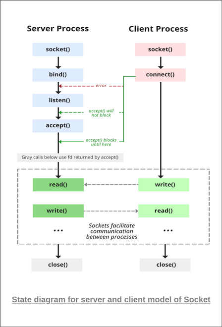
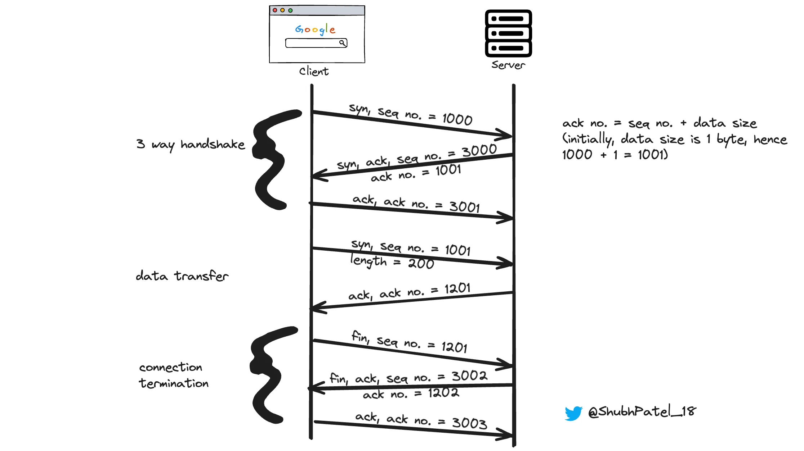
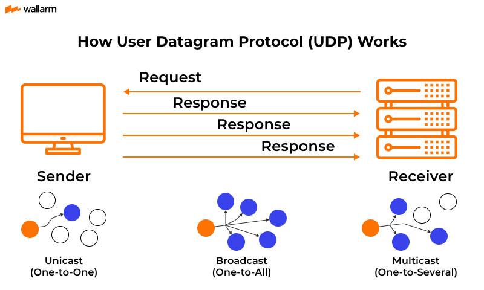

# 1.3 Network Sockets & The Transport Layer (TCP/UDP)

### Setup Stage

To deeply understand how data physically moves across the wire and how a server accepts connections, we must understand the Transport Layer of the network. We will start from the absolute basics of IP addresses, Ports, and the OS-level concept of a "Socket", culminating in the mechanics of TCP and UDP.

To observe network sockets at the Operating System level, we need a few core Linux networking utilities. We will use `netcat` (a tool to read/write raw network connections), `lsof` (to list open file descriptors/sockets), and `tcpdump` (to capture raw network packets).

Please open your WSL2/Linux terminal and run the following commands to install these network utilities:

```bash
# Update package lists
sudo apt update

# Install the networking utilities
sudo apt install netcat-openbsd lsof tcpdump

# Verify netcat is installed
nc -h
```

---

### Stage 1: Concept & Core Problem (Network Sockets & The Transport Layer)

Let us start from the absolute basics of how data travels between two completely isolated computers. 

#### Step 1: The Addressing Problem (IP Addresses vs. Ports)
When your server wants to send data to a database on another machine, the data is broken down into small chunks of binary data called **Packets**. 
To get a packet across the physical internet, it requires an **IP Address** (e.g., `192.168.1.5`). The network routers use this IP address to physically locate the target machine's hardware Network Interface Card (NIC).

However, arriving at the physical machine is not enough. A single machine might be running 50 different processes (a Web Server, an SSH daemon, a Database). If a packet arrives at the NIC, how does the Operating System know *which process* should receive the data?

To solve this, the Transport Layer introduces the **Port**. 
A Port is simply a 16-bit integer (ranging from 0 to 65535) embedded in the packet's header. 
*   **IP Address:** Identifies the physical machine.
*   **Port:** Identifies the specific Virtual Memory space (the Process) on that machine.

#### Step 2: The Network Socket (The OS Gateway)
A process cannot physically touch the network card. Instead, it asks the OS Kernel to create a **Socket**.
A Socket is a data structure (and a memory buffer) inside the OS Kernel. 
1. The process tells the OS: *"Create a Socket and bind it to Port 8080."*
2. When electrical signals arrive at the NIC, the OS Kernel parses the packet header.
3. If the packet's destination port is 8080, the OS copies the packet's payload directly into the memory buffer of that specific Socket.
4. The process (via the Event Loop or a blocking thread) reads the data from that Socket buffer.

#### Step 3: The Core Engineering Problem — The Unreliable Wire
The physical wire between two computers is hostile. Copper wires suffer from electromagnetic interference; network routers get overloaded and physically drop packets to save memory. 
Because of this, the network provides **zero guarantees** that a packet will arrive, or that it will arrive in the correct order.

We have two fundamental protocols to handle this physical limitation: **UDP** and **TCP**.

#### Step 4: UDP (User Datagram Protocol) - "Fire and Forget"
UDP is a purely mechanical pass-through. 
When a process sends data via UDP, the OS wraps the data with a destination IP and Port, and blasts it out of the network card. 
*   **Mechanics:** There is no setup, no checking if the target machine is even turned on, and no tracking of lost packets. 
*   **Result:** It is incredibly fast. It is used for live video streaming or multiplayer gaming, where if a packet of data is lost, it is better to just skip it and render the next frame rather than pausing the entire stream to wait for a retry.

#### Step 5: TCP (Transmission Control Protocol) - "Reliability via Mathematics"
If you are sending a JSON payload to a database, dropping a single packet corrupts the entire JSON object. You need absolute mathematical certainty that every single byte arrived in the exact correct order. TCP solves this algorithmically inside the OS Kernel.

TCP provides reliability through three core mechanics:
1.  **The 3-Way Handshake (Connection Overhead):** Before sending any actual data, the sender's OS and the receiver's OS must exchange 3 empty packets (SYN, SYN-ACK, ACK). This establishes a stateful "Connection" in the memory of both kernels, ensuring both sides have allocated memory buffers for the upcoming data.
2.  **Sequence Numbers & Acknowledgments (ACKs):** When TCP breaks a 10MB JSON file into 7,000 individual packets, it assigns a sequential integer to every single packet (e.g., Seq: 1, Seq: 2). When the receiving OS gets Packet 1, it must send an "ACK: 1" packet back. If the sender does not receive the ACK within a few milliseconds, it assumes the packet was dropped and retransmits it. 
3.  **The Sliding Window (Congestion Control):** If a fast server sends 5,000 packets instantly, but the receiving process is slow, the receiver's Socket memory buffer will overflow, crashing the process. TCP adds a "Window Size" integer to every ACK packet. This dynamically tells the sender: *"I only have 500 kilobytes of free memory buffer left, do not send me more than that."*

[Helpful video on Network Sockets](https://www.youtube.com/watch?v=D26sUZ6DHNQ)

#### Visual Data Flow



State Diagram of Server and Client With Their Sockets



TCP 3 way handshake



UDP Diagram

---

### Stage 2: Technical Walkthrough (Network Sockets & The Transport Layer)

Let us examine exactly how the Linux Operating System kernel manages memory and CPU interrupts to handle a TCP connection. We will trace the lifecycle of a network socket from the moment the server boots up, through the TCP handshake, to the data transfer.

#### Step 1: Socket Creation & The File Descriptor Table
When a backend application (like a Node.js or C++ server) starts and wants to listen for incoming network traffic, it must execute a series of System Calls to the OS Kernel.
1.  **`socket()`:** The process asks the Kernel to create an endpoint for communication. The Kernel allocates a small data structure in Kernel Space. To give the process a way to reference this structure, the Kernel returns a **File Descriptor (FD)**. A File Descriptor is just a simple integer (e.g., `FD 3`). To the OS, a network socket is treated exactly the same as a text file on a hard drive.
2.  **`bind()`:** The process tells the Kernel, *"Associate FD 3 with Port 8080."*
3.  **`listen()`:** The process tells the Kernel to actively monitor Port 8080 and allocate two memory queues for this socket: the **SYN Queue** (for pending handshakes) and the **Accept Queue** (for fully established connections).

At this point, the server process typically pauses (or registers this FD with `epoll` in an Event Loop) and waits.

#### Step 2: The Kernel-Level TCP Handshake
A client machine decides to connect to our server. 
**Crucially, the 3-Way Handshake happens entirely inside the OS Kernel.** The server application (Node.js/C++) is completely unaware that this is happening.

1.  **SYN:** The client's packet arrives at the physical NIC. A hardware interrupt is triggered. The Kernel reads the packet header, sees the destination is Port 8080, and sees the `SYN` flag is set. The Kernel creates a temporary connection state and places it in the **SYN Queue**.
2.  **SYN-ACK:** The server's OS Kernel automatically drafts a reply packet with the `SYN-ACK` flags and sends it back out the network card.
3.  **ACK:** The client replies with the final `ACK` packet. The server's NIC interrupts the CPU again. The Kernel reads the `ACK`, removes the connection from the SYN Queue, and moves it to the **Accept Queue**. The TCP connection is now mathematically established.

#### Step 3: Accepting the Connection (Socket Duplication)
Now that a reliable TCP connection exists in the Accept Queue, the OS Kernel wakes up the server application process.
1.  The application executes the `accept()` system call.
2.  The Kernel pops the established connection off the Accept Queue.
3.  **The Forking Mechanic:** The Kernel does *not* use the original listening Socket (`FD 3`) to talk to the client. If it did, it couldn't listen for other users. Instead, the Kernel dynamically creates a **brand new Socket** and a new File Descriptor (e.g., `FD 4`). 
4.  `FD 3` remains bound to Port 8080, waiting for new users. `FD 4` is dedicated exclusively to the unique IP and Port of this specific client. 

#### Step 4: Data Transfer and Kernel Buffers
The client sends a JSON payload. 
1.  The packets arrive at the NIC. The hardware interrupts the CPU.
2.  The OS Kernel strips away the TCP headers and verifies the Sequence Numbers. 
3.  The Kernel writes the raw JSON bytes into a dedicated **Receive Buffer** (a block of Kernel memory specifically allocated for `FD 4`). 
4.  The Kernel automatically generates and sends the TCP `ACK` back to the client, confirming receipt.
5.  The application process then executes a `read()` system call on `FD 4`. The CPU copies the JSON data from the Kernel's Receive Buffer across the boundary into the application's Heap Memory (User Space).

#### Step 5: Connection Teardown (The 4-Way FIN)
When the client is done, it sends a TCP packet with the `FIN` (Finish) flag. 
Because TCP guarantees reliable delivery in *both* directions independently, closing a connection requires a 4-step sequence:
1.  Client sends `FIN`.
2.  Server OS replies with `ACK`. (Client can no longer send data, but can still receive).
3.  Server application finishes sending its final HTTP response, then executes the `close()` system call. The Server OS sends its own `FIN`.
4.  Client OS replies with a final `ACK`.

Once the final `ACK` is received, the OS Kernel completely destroys the Socket structure for `FD 4`, freeing up the Kernel memory buffers.

***
