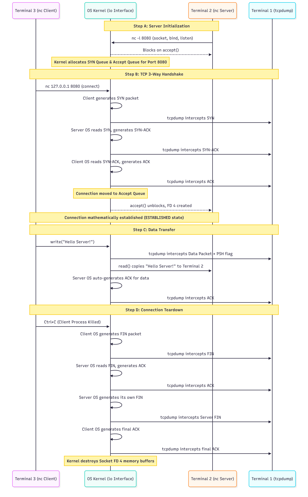

# 1.3 Network Sockets & The Transport Layer (TCP/UDP)

### Setup Stage

To deeply understand how data physically moves across the wire and how a server accepts connections, we must understand the Transport Layer of the network. We will start from the absolute basics of IP addresses, Ports, and the OS-level concept of a "Socket", culminating in the mechanics of TCP and UDP.

To observe network sockets at the Operating System level, we need a few core Linux networking utilities. We will use `netcat` (a tool to read/write raw network connections), `lsof` (to list open file descriptors/sockets), and `tcpdump` (to capture raw network packets).

Please open your WSL2/Linux terminal and run the following commands to install these network utilities:

```bash
# Update package lists
sudo apt update

# Install the networking utilities
sudo apt install netcat-openbsd lsof tcpdump

# Verify netcat is installed
nc -h
```

---

### Stage 1: Concept & Core Problem (Network Sockets & The Transport Layer)

Let us start from the absolute basics of how data travels between two completely isolated computers. 

#### Step 1: The Addressing Problem (IP Addresses vs. Ports)
When your server wants to send data to a database on another machine, the data is broken down into small chunks of binary data called **Packets**. 
To get a packet across the physical internet, it requires an **IP Address** (e.g., `192.168.1.5`). The network routers use this IP address to physically locate the target machine's hardware Network Interface Card (NIC).

However, arriving at the physical machine is not enough. A single machine might be running 50 different processes (a Web Server, an SSH daemon, a Database). If a packet arrives at the NIC, how does the Operating System know *which process* should receive the data?

To solve this, the Transport Layer introduces the **Port**. 
A Port is simply a 16-bit integer (ranging from 0 to 65535) embedded in the packet's header. 
*   **IP Address:** Identifies the physical machine.
*   **Port:** Identifies the specific Virtual Memory space (the Process) on that machine.

#### Step 2: The Network Socket (The OS Gateway)
A process cannot physically touch the network card. Instead, it asks the OS Kernel to create a **Socket**.
A Socket is a data structure (and a memory buffer) inside the OS Kernel. 
1. The process tells the OS: *"Create a Socket and bind it to Port 8080."*
2. When electrical signals arrive at the NIC, the OS Kernel parses the packet header.
3. If the packet's destination port is 8080, the OS copies the packet's payload directly into the memory buffer of that specific Socket.
4. The process (via the Event Loop or a blocking thread) reads the data from that Socket buffer.

#### Step 3: The Core Engineering Problem — The Unreliable Wire
The physical wire between two computers is hostile. Copper wires suffer from electromagnetic interference; network routers get overloaded and physically drop packets to save memory. 
Because of this, the network provides **zero guarantees** that a packet will arrive, or that it will arrive in the correct order.

We have two fundamental protocols to handle this physical limitation: **UDP** and **TCP**.

#### Step 4: UDP (User Datagram Protocol) - "Fire and Forget"
UDP is a purely mechanical pass-through. 
When a process sends data via UDP, the OS wraps the data with a destination IP and Port, and blasts it out of the network card. 
*   **Mechanics:** There is no setup, no checking if the target machine is even turned on, and no tracking of lost packets. 
*   **Result:** It is incredibly fast. It is used for live video streaming or multiplayer gaming, where if a packet of data is lost, it is better to just skip it and render the next frame rather than pausing the entire stream to wait for a retry.

#### Step 5: TCP (Transmission Control Protocol) - "Reliability via Mathematics"
If you are sending a JSON payload to a database, dropping a single packet corrupts the entire JSON object. You need absolute mathematical certainty that every single byte arrived in the exact correct order. TCP solves this algorithmically inside the OS Kernel.

TCP provides reliability through three core mechanics:
1.  **The 3-Way Handshake (Connection Overhead):** Before sending any actual data, the sender's OS and the receiver's OS must exchange 3 empty packets (SYN, SYN-ACK, ACK). This establishes a stateful "Connection" in the memory of both kernels, ensuring both sides have allocated memory buffers for the upcoming data.
2.  **Sequence Numbers & Acknowledgments (ACKs):** When TCP breaks a 10MB JSON file into 7,000 individual packets, it assigns a sequential integer to every single packet (e.g., Seq: 1, Seq: 2). When the receiving OS gets Packet 1, it must send an "ACK: 1" packet back. If the sender does not receive the ACK within a few milliseconds, it assumes the packet was dropped and retransmits it. 
3.  **The Sliding Window (Congestion Control):** If a fast server sends 5,000 packets instantly, but the receiving process is slow, the receiver's Socket memory buffer will overflow, crashing the process. TCP adds a "Window Size" integer to every ACK packet. This dynamically tells the sender: *"I only have 500 kilobytes of free memory buffer left, do not send me more than that."*

[Helpful video on Network Sockets](https://www.youtube.com/watch?v=D26sUZ6DHNQ)

#### Visual Data Flow


State Diagram of Server and Client With Their Sockets


TCP 3 way handshake


UDP Diagram

---

### Stage 2: Technical Walkthrough (Network Sockets & The Transport Layer)

Let us examine exactly how the Linux Operating System kernel manages memory and CPU interrupts to handle a TCP connection. We will trace the lifecycle of a network socket from the moment the server boots up, through the TCP handshake, to the data transfer.

#### Step 1: Socket Creation & The File Descriptor Table
When a backend application (like a Node.js or C++ server) starts and wants to listen for incoming network traffic, it must execute a series of System Calls to the OS Kernel.
1.  **`socket()`:** The process asks the Kernel to create an endpoint for communication. The Kernel allocates a small data structure in Kernel Space. To give the process a way to reference this structure, the Kernel returns a **File Descriptor (FD)**. A File Descriptor is just a simple integer (e.g., `FD 3`). To the OS, a network socket is treated exactly the same as a text file on a hard drive.
2.  **`bind()`:** The process tells the Kernel, *"Associate FD 3 with Port 8080."*
3.  **`listen()`:** The process tells the Kernel to actively monitor Port 8080 and allocate two memory queues for this socket: the **SYN Queue** (for pending handshakes) and the **Accept Queue** (for fully established connections).

At this point, the server process typically pauses (or registers this FD with `epoll` in an Event Loop) and waits.

#### Step 2: The Kernel-Level TCP Handshake
A client machine decides to connect to our server. 
**Crucially, the 3-Way Handshake happens entirely inside the OS Kernel.** The server application (Node.js/C++) is completely unaware that this is happening.

1.  **SYN:** The client's packet arrives at the physical NIC. A hardware interrupt is triggered. The Kernel reads the packet header, sees the destination is Port 8080, and sees the `SYN` flag is set. The Kernel creates a temporary connection state and places it in the **SYN Queue**.
2.  **SYN-ACK:** The server's OS Kernel automatically drafts a reply packet with the `SYN-ACK` flags and sends it back out the network card.
3.  **ACK:** The client replies with the final `ACK` packet. The server's NIC interrupts the CPU again. The Kernel reads the `ACK`, removes the connection from the SYN Queue, and moves it to the **Accept Queue**. The TCP connection is now mathematically established.

#### Step 3: Accepting the Connection (Socket Duplication)
Now that a reliable TCP connection exists in the Accept Queue, the OS Kernel wakes up the server application process.
1.  The application executes the `accept()` system call.
2.  The Kernel pops the established connection off the Accept Queue.
3.  **The Forking Mechanic:** The Kernel does *not* use the original listening Socket (`FD 3`) to talk to the client. If it did, it couldn't listen for other users. Instead, the Kernel dynamically creates a **brand new Socket** and a new File Descriptor (e.g., `FD 4`). 
4.  `FD 3` remains bound to Port 8080, waiting for new users. `FD 4` is dedicated exclusively to the unique IP and Port of this specific client. 

#### Step 4: Data Transfer and Kernel Buffers
The client sends a JSON payload. 
1.  The packets arrive at the NIC. The hardware interrupts the CPU.
2.  The OS Kernel strips away the TCP headers and verifies the Sequence Numbers. 
3.  The Kernel writes the raw JSON bytes into a dedicated **Receive Buffer** (a block of Kernel memory specifically allocated for `FD 4`). 
4.  The Kernel automatically generates and sends the TCP `ACK` back to the client, confirming receipt.
5.  The application process then executes a `read()` system call on `FD 4`. The CPU copies the JSON data from the Kernel's Receive Buffer across the boundary into the application's Heap Memory (User Space).

#### Step 5: Connection Teardown (The 4-Way FIN)
When the client is done, it sends a TCP packet with the `FIN` (Finish) flag. 
Because TCP guarantees reliable delivery in *both* directions independently, closing a connection requires a 4-step sequence:
1.  Client sends `FIN`.
2.  Server OS replies with `ACK`. (Client can no longer send data, but can still receive).
3.  Server application finishes sending its final HTTP response, then executes the `close()` system call. The Server OS sends its own `FIN`.
4.  Client OS replies with a final `ACK`.

Once the final `ACK` is received, the OS Kernel completely destroys the Socket structure for `FD 4`, freeing up the Kernel memory buffers.

---

### Stage 3: Implementation (Network Sockets & The Transport Layer)

For this implementation, we will not write application code. Instead, we will act as the OS Kernel ourselves. We will use the raw Linux utilities we installed to manually create a Socket, observe the Kernel allocating the File Descriptor, and capture the exact TCP 3-Way Handshake in real-time.

You will need to open **three separate WSL2 terminal windows** side-by-side.

#### Terminal 1: The Packet Sniffer (Network Layer)
In your first terminal, run this command to start `tcpdump`. This tells the OS to monitor the local loopback network interface (`lo`) and print out every raw TCP packet header traveling across Port 8080.
*(Note: `sudo` is required because sniffing packets is an OS-privileged kernel operation).*

```bash
sudo tcpdump -i lo -n -S tcp port 8080
```
*(Leave this terminal running. It will wait silently).*

#### Terminal 2: The Server Socket (Transport Layer)
In your second terminal, we will use `netcat` (`nc`) to ask the OS to create a listening socket bound to Port 8080.

```bash
nc -l 8080
```
*(Leave this terminal running. It will also wait silently, as it is now blocked on the `accept()` system call).*

#### Terminal 3: The Observer & The Client (Application Layer)
In your third terminal, run the following commands sequentially.

**Step A: Inspect the File Descriptor**
Run `lsof` (List Open Files) to ask the OS to show us the internal Kernel socket structures tied to Port 8080.

```bash
lsof -i :8080
```

**Step B: Initiate the TCP Handshake**
Now, act as the Client. Use `netcat` to initiate a connection to the Server socket on your local machine (`127.0.0.1`).

```bash
nc 127.0.0.1 8080
```

**Step C: Send the Payload**
Notice that in Terminal 3, you now have a blank prompt. The connection is established. 
1. Type: `Hello Server!`
2. Press `Enter`.
3. Look at Terminal 2. You will see the text appear there.

**Step D: The Teardown**
In Terminal 3, press `Ctrl + C` to kill the client process.

#### Sequence Diagram



---

### Stage 4: Code Breakdown (Network Sockets & The Transport Layer)

Let's start with stage 4!

```bash
sudo tcpdump -i lo -n -S tcp port 8080

tcpdump: verbose output suppressed, use -v[v]... for full protocol decode
listening on lo, link-type EN10MB (Ethernet), snapshot length 262144 bytes
15:18:54.805344 IP 127.0.0.1.49718 > 127.0.0.1.8080: Flags [S], seq 2953352401, win 65495, options [mss 65495,sackOK,TS val 4285809434 ecr 0,nop,wscale 10], length 0
15:18:54.805375 IP 127.0.0.1.8080 > 127.0.0.1.49718: Flags [S.], seq 1300591698, ack 2953352402, win 65483, options [mss 65495,sackOK,TS val 444901215 ecr 4285809434,nop,wscale 10], length 0
15:18:54.805396 IP 127.0.0.1.49718 > 127.0.0.1.8080: Flags [.], ack 1300591699, win 64, options [nop,nop,TS val 4285809434 ecr 444901215], length 0
15:18:57.845733 IP 127.0.0.1.49718 > 127.0.0.1.8080: Flags [P.], seq 2953352402:2953352410, ack 1300591699, win 64, options [nop,nop,TS val 4285812474 ecr 444901215], length 8: HTTP
15:18:57.845748 IP 127.0.0.1.8080 > 127.0.0.1.49718: Flags [.], ack 2953352410, win 64, options [nop,nop,TS val 444904255 ecr 4285812474], length 0
```

```bash
nc -l  8080

Hello!
```

```bash
lsof -i :8080

COMMAND   PID USER FD   TYPE DEVICE SIZE/OFF NODE NAME
nc      54924 username 3u  IPv4 236927      0t0  TCP *:http-alt (LISTEN)
```

```bash
nc 127.0.0.1 8080

Hello!!
```

Here is the line-by-line breakdown of the exact text outputs you generated, mapping them directly back to the architectural theory from Stage 1 and the kernel runtime mechanics from Stage 2.

#### 1. The Kernel Socket Setup (The `lsof` Output)
```text
COMMAND   PID USER FD   TYPE DEVICE SIZE/OFF NODE NAME
nc      54924 root 3u  IPv4 236927      0t0  TCP *:http-alt (LISTEN)
```
*   **Mechanics (Stage 2, Step 1):** You ran `nc -l 8080`. The OS Kernel created a process (PID `54924`). 
*   **`FD 3u`:** The OS executed the `socket()` system call and allocated **File Descriptor 3**. The `u` means it was opened for both reading and writing. 
*   **`*:http-alt`:** The OS executed `bind()`, tying this socket to Port 8080 (which `lsof` translates to its default name, `http-alt`). The `*` means it is bound to all IP addresses on your motherboard.
*   **`(LISTEN)`:** The OS executed `listen()`. The Kernel has officially allocated the **SYN Queue** and **Accept Queue** in kernel memory and is actively monitoring the network interface. The `nc` application is now completely asleep, blocked on the `accept()` call.

#### 2. The TCP 3-Way Handshake (The `tcpdump` Output)

**Line 1: The SYN**
```text
15:18:54.805344 IP 127.0.0.1.49718 > 127.0.0.1.8080: Flags [S], seq 2953352401, win 65495... length 0
```
*   **Mechanics (Stage 2, Step 2):** You executed `nc 127.0.0.1 8080` in Terminal 3. The client OS assigns a random high port (`49718`) to the client process.
*   **`Flags [S]`:** The client OS Kernel generates a packet with the **SYN** (Synchronize) bit flipped to 1.
*   **`seq 2953352401`:** The client OS generates a massive random starting mathematical sequence number. 
*   **Architecture (Stage 1):** The Server OS Kernel intercepts this packet, reads Port 8080, and places this pending connection into the **SYN Queue**.

**Line 2: The SYN-ACK**
```text
15:18:54.805375 IP 127.0.0.1.8080 > 127.0.0.1.49718: Flags [S.], seq 1300591698, ack 2953352402... length 0
```
*   **Mechanics:** Notice the timestamp. Exactly `0.000031` seconds later, the Server OS Kernel automatically replies. The `nc` server application *still* does not know this is happening.
*   **`Flags [S.]`:** The `[S]` is the Server's SYN. The `[.]` represents the ACK (Acknowledgment).
*   **`seq 1300591698`:** The Server OS generates its *own* random sequence number for the reverse direction.
*   **`ack 2953352402`:** The Server OS mathematically confirms the client's packet by taking the client's sequence number (`2953352401`) and adding exactly `1` to it.

**Line 3: The ACK (Handshake Complete)**
```text
15:18:54.805396 IP 127.0.0.1.49718 > 127.0.0.1.8080: Flags [.], ack 1300591699... length 0
```
*   **Mechanics:** The Client OS sends the final `[.]` (ACK). It confirms the server's sequence by adding 1 (`1300591698` + 1 = `1300591699`).
*   **State Change (Stage 2, Step 3):** The connection is now mathematically established. The Server OS moves this connection from the SYN Queue to the **Accept Queue**.
*   The `accept()` system call inside the server's `nc` process finally unblocks. The OS gives the server a brand new File Descriptor (e.g., `FD 4`) tied explicitly to IP `127.0.0.1` and Port `49718`.

#### 3. The Data Transfer (Payload Encapsulation)

**Line 4: The Data Push**
```text
15:18:57.845733 IP 127.0.0.1.49718 > 127.0.0.1.8080: Flags [P.], seq 2953352402:2953352410, ack 1300591699... length 8: HTTP
```
*   **Mechanics (Stage 2, Step 4):** Three seconds later, you typed `Hello!!` and pressed Enter. The Client OS copied these 8 bytes (7 characters + 1 newline character) into the socket buffer.
*   **`Flags [P.]`:** The OS sends the packet with the **PSH** (Push) and **ACK** flags. The PSH flag is a hardware instruction telling the Server OS: *"Do not hold this data in your kernel buffer. Push it immediately up to the application's memory space."*
*   **`seq 2953352402:2953352410`:** The Sequence number physically jumps by 8 bytes, representing the exact byte positions of this payload.
*   **Architecture (Stage 1, Step 5):** The Server OS receives this. It verifies the sequence number to ensure no packets were dropped. It copies the 8 bytes into the Receive Buffer of `FD 4`. The `nc` process executes a `read()` system call, grabs the bytes, and prints `Hello!!` to your terminal.

**Line 5: The Data Acknowledgment**
```text
15:18:57.845748 IP 127.0.0.1.8080 > 127.0.0.1.49718: Flags [.], ack 2953352410... length 0
```
*   **Mechanics:** Immediately after the Server OS receives the data, the Kernel automatically drafts a raw TCP `ACK` `[.]` packet and sends it back to the client.
*   **`ack 2953352410`:** The Server OS confirms it successfully received all bytes up to this exact sequence integer. If the Client OS did not receive this ACK within a few milliseconds, it would have re-transmitted the "Hello!!" packet.

```bash
15:22:15.045940 IP 127.0.0.1.49718 > 127.0.0.1.8080: Flags [F.], seq 2953352410, ack 1300591699, win 64, options [nop,nop,TS val 4286009674 ecr 444904255], length 0
15:22:15.046091 IP 127.0.0.1.8080 > 127.0.0.1.49718: Flags [F.], seq 1300591699, ack 2953352411, win 64, options [nop,nop,TS val 445101455 ecr 4286009674], length 0
15:22:15.046133 IP 127.0.0.1.49718 > 127.0.0.1.8080: Flags [.], ack 1300591700, win 64, options [nop,nop,TS val 4286009674 ecr 445101455], length 0
```

#### 4. The TCP Connection Teardown

**Line 1: The Client FIN**
```text
15:22:15.045940 IP 127.0.0.1.49718 > 127.0.0.1.8080: Flags [F.], seq 2953352410, ack 1300591699... length 0
```
*   **Mechanics (Stage 2, Step 5):** You pressed `Ctrl+C` in Terminal 3. The Linux OS immediately sent a `SIGINT` (Interrupt Signal) to the `nc` client process, forcefully terminating it. 
*   Because the process died, the OS Kernel automatically stepped in to clean up its memory. It executed a `close()` system call on the socket File Descriptor.
*   **`Flags [F.]`:** The Kernel drafted a packet with the **FIN** (Finish) and **ACK** flags. This mathematically informs the Server OS: *"I am destroying my Send Buffer. I will not send any more data."*

**Line 2: The Server FIN-ACK (The OS Optimization)**
```text
15:22:15.046091 IP 127.0.0.1.8080 > 127.0.0.1.49718: Flags [F.], seq 1300591699, ack 2953352411... length 0
```
*   **Mechanics:** The Server OS received the Client's `FIN`. 
*   Normally, the Server OS would send an `ACK`, wait for the Server application to finish whatever it is doing, and then send a `FIN` later (the 4-way teardown). 
*   However, `netcat` is programmed to exit immediately when its client disconnects. When the Server OS notified `nc` that the client sent a `FIN`, the `nc` server process immediately called `close()` on its own end (`FD 4`) and terminated.
*   **The Optimization:** Because the Server OS needed to send an `ACK` for the client's `FIN`, and *also* needed to send its own `FIN` simultaneously, the Kernel combined them into a single packet to save network bandwidth.
*   **`Flags [F.]`:** This single packet contains both the Server's **FIN** and the **ACK** (acknowledging sequence `2953352411`, which is the client's FIN sequence `2953352410` + 1).

**Line 3: The Final Client ACK**
```text
15:22:15.046133 IP 127.0.0.1.49718 > 127.0.0.1.8080: Flags [.], ack 1300591700... length 0
```
*   **Mechanics:** The Client OS Kernel received the Server's `FIN`. It drafted the absolute final `[.]` (ACK) packet, confirming it received the Server's sequence (`1300591699` + 1 = `1300591700`).
*   **The Hardware Cleanup:** The moment this packet left the Client's network card, the Client OS Kernel permanently wiped the socket memory structure from RAM. 
*   When this packet arrived at the Server's network card, the Server OS Kernel read it, verified the sequence, and permanently wiped `FD 4` (the dedicated connection socket) and `FD 3` (the listening socket, because the `nc` process died) from its RAM.

The TCP connection is now mathematically and physically erased from the Operating System.

```bash
lsof -i :8080

nc      96765 arya 3u  IPv4 294851      0t0  TCP *:http-alt (LISTEN)
nc      96765 arya 4u  IPv4 294852      0t0  TCP localhost:http-alt->localhost:37308 (ESTABLISHED)
nc      97042 arya 3u  IPv4 301815      0t0  TCP localhost:37308->localhost:http-alt (ESTABLISHED)
```

This output is arguably the most beautiful proof of the **Socket Duplication** mechanic we discussed in Stage 2 (Step 3). By running `lsof` while the connection was active, you caught the Operating System Kernel exactly in the middle of managing the memory buffers.

Here is the mechanical breakdown of those three lines:

#### 5. The Active Connection State (The `lsof` Output)

**Line 1: The Original Listening Socket**
```text
nc      96765 arya 3u  IPv4 294851      0t0  TCP *:http-alt (LISTEN)
```
*   **Mechanics:** This is the Server process (PID `96765`). 
*   **`FD 3u`:** This is the original File Descriptor bound to Port 8080.
*   **Architecture (Stage 2, Step 3):** Even though a client has successfully connected, this original socket remains strictly in the `(LISTEN)` state. Its entire job in the Kernel is to continue managing the SYN and Accept queues for *future* connections. It does not handle the data transfer for the currently connected client.

**Line 2: The Dedicated Server Socket (The Forking Mechanic)**
```text
nc      96765 arya 4u  IPv4 294852      0t0  TCP localhost:http-alt->localhost:37308 (ESTABLISHED)
```
*   **Mechanics:** Notice the PID (`96765`) is exactly the same as Line 1. This belongs to your Server process.
*   **`FD 4u`:** This is the mathematical proof of `accept()`. The OS Kernel dynamically generated a **brand new File Descriptor (FD 4)** and allocated new Send/Receive memory buffers specifically for this conversation.
*   **`localhost:http-alt->localhost:37308`:** The Kernel maps this socket explicitly to the client's random port (`37308`). 
*   **`(ESTABLISHED)`:** The 3-Way Handshake is complete. When you typed "Hello!!", the Server OS copied the payload from the NIC into the Receive Buffer of `FD 4`, not `FD 3`.

**Line 3: The Client Socket**
```text
nc      97042 arya 3u  IPv4 301815      0t0  TCP localhost:37308->localhost:http-alt (ESTABLISHED)
```
*   **Mechanics:** Notice the different PID (`97042`). This is your Client terminal process.
*   **`FD 3u`:** When the client process executed the `socket()` system call, the OS Kernel assigned it its own File Descriptor (`FD 3`). (It is 3 because it is the first network socket opened by this specific process).
*   **`localhost:37308->localhost:http-alt`:** This perfectly mirrors Line 2, but in reverse. The Client socket originates from `37308` and points to the Server at `8080` (`http-alt`). 
*   **Architecture:** This represents the client-side memory buffers. When you pressed Enter on your keyboard, the client process executed `write()` on this `FD 3`, pushing the bytes down into the Client Kernel to be encapsulated into TCP packets and sent to the Server's `FD 4`.

***

### Doubt Clearance and Q/A

> **Q1. I would like you to explain me the transportation of the packets through the network. Explain me it raw and give the clear picture of what actually happens step-by-step and clear details. Take the example of the database request. How is it encapsulated with different headers at each stage then how does it hop between routers (say for example 3 routers) how and what exactly the packet finds it's way through between hops and also how does it know which machine it is intended for then which process inside that machine. Also show a clear distinction between IP and MAC addresses while it is traveling. Make the example extensive so it covers the entire journey in details. Also explicitly mention the upward and downward movement among layers while traveling through the network briefly.**

**Answer:**

To understand network transportation, we must trace the data through the **Network Layers** (often modeled as the TCP/IP or OSI model). The fundamental rule of network travel is **Encapsulation**: as data moves *down* the layers on the sending machine, it is wrapped in successive headers. As it moves *up* the layers on the receiving machine, headers are stripped away.

Here is the exact step-by-step journey of a database request (e.g., `SELECT * FROM users`) traveling from a Backend Server (the Client) to a Database Server, passing through 3 routers.

#### Phase 1: Downward Movement & Encapsulation (The Sender)

The Node.js backend application executes the database query. The text string `SELECT * FROM users` sits in the application's Heap memory.

**1. The Application Layer (Payload)**
The process executes a `write()` system call, passing the memory pointer of the SQL string to the OS Kernel's socket buffer. From this point on, the OS Kernel takes complete control.

**2. The Transport Layer (Process-to-Process Targeting)**
The Kernel reads the raw bytes and wraps them in a **TCP Header** (typically 20 bytes). 
*   **What it adds:** Source Port (a random high port, e.g., `54321`) and Destination Port (the database port, e.g., `3306`). It also adds the Sequence Number for reliability.
*   **Purpose:** This header ensures that when the packet arrives at the final machine, the target OS knows exactly which specific Process (via the Socket File Descriptor) should receive the data.

**3. The Network Layer (Machine-to-Machine Targeting)**
The Kernel takes the entire TCP segment (TCP Header + SQL Payload) and wraps it in an **IP Header** (typically 20 bytes).
*   **What it adds:** Source IP Address (`10.0.0.5`) and Destination IP Address (`192.168.100.50`).
*   **Purpose:** The IP Address is the *logical, absolute end-to-end destination*. **Crucial Rule:** The Source IP and Destination IP inside this header will *never change* for the entire duration of the journey.

**4. The Data Link Layer (Hop-to-Hop Targeting)**
The OS must now push the packet out of the physical motherboard. It wraps the IP packet in an **Ethernet Frame** (MAC Header).
*   **What it adds:** Source MAC Address (the permanent physical hardware address of the sender's Network Card) and Destination MAC Address.
*   **The IP vs. MAC Distinction:** The sender's OS does *not* put the Database Server's MAC address here, because MAC addresses only work on local, physical networks. Instead, the OS looks at its routing table, sees the Database IP is outside its local network, and puts the **MAC address of Router 1 (the Default Gateway)** as the destination.

**5. The Physical Layer**
The sender's Network Interface Card (NIC) converts the binary 1s and 0s of the fully encapsulated frame into physical electrical voltages (or light pulses) and blasts them over the ethernet cable.

#### Phase 2: Hop-by-Hop Routing (The Middlemen)

The electrical signals travel down the copper wire and hit **Router 1**. 

**Hop 1: Router 1**
1.  **Upward to Layer 2:** Router 1's NIC receives the electricity, converts it to binary, and reads the Data Link (MAC) Header. It sees its own MAC address as the destination. It accepts the frame and **strips off and destroys the MAC Header**.
2.  **Upward to Layer 3:** Router 1 reads the exposed IP Header. It looks at the Destination IP (`192.168.100.50`). 
3.  **Routing:** The router's CPU checks its internal Routing Table memory structure. The table mathematically maps IP subnets to physical router ports. The table says: *"To get to `192.168.100.x`, send the packet out Port 4 toward Router 2."*
4.  **Downward to Layer 2:** Router 1 wraps the IP packet in a **brand new MAC Header**. The Source MAC is now Router 1's Port 4. The Destination MAC is Router 2's NIC.
5.  **Downward to Layer 1:** Router 1 converts the frame back to electricity and sends it to Router 2.

**Hop 2: Router 2**
Router 2 repeats the exact same mechanical process. It receives the frame, strips the MAC header, inspects the absolute Destination IP, consults its own Routing Table, constructs a new MAC header pointing to Router 3, and pushes it out the physical wire.

**Hop 3: Router 3 (The Final Network)**
1.  Router 3 receives the frame, strips the MAC header, and reads the Destination IP (`192.168.100.50`).
2.  Router 3's routing table reveals that this IP belongs to the local subnet directly connected to Router 3. 
3.  Router 3 now needs the physical hardware address of the Database machine. It checks its ARP (Address Resolution Protocol) cache in memory, which maps `192.168.100.50` to the Database Server's specific MAC Address.
4.  Router 3 constructs the final MAC Header (Source: Router 3, Destination: Database Server) and pushes it out the local ethernet switch.

#### Phase 3: Upward Movement & Decapsulation (The Receiver)

The electrical pulses arrive at the Database Server's physical machine.

**1. The Data Link Layer**
The Database Server's NIC converts the pulses to binary. It reads the Destination MAC address. Since it perfectly matches its own hardware address, it accepts the frame. It **strips off the MAC Header** and passes the remaining data up to the OS Kernel via a hardware interrupt.

**2. The Network Layer**
The OS Kernel inspects the IP Header. It verifies the Destination IP matches its own assigned IP Address (`192.168.100.50`). It verifies the packet checksum for corruption, **strips off the IP Header**, and passes the inner TCP segment further up into the networking stack.

**3. The Transport Layer**
The OS Kernel inspects the TCP Header. 
*   It reads the Destination Port (`3306`).
*   It looks up its internal File Descriptor table to see if any running process is actively bound to Port `3306`. It finds the Database Process listening on `FD 4`.
*   It reads the TCP Sequence Number to ensure no packets were skipped. 
*   The OS Kernel drafts a TCP `ACK` packet to send back to the client, confirming receipt.
*   Finally, the OS **strips off the TCP Header**.

**4. The Application Layer**
Only the raw payload (`SELECT * FROM users`) remains. 
The OS Kernel copies these raw bytes into the Socket Receive Buffer in kernel memory. It then signals the Database process (via `epoll` or by waking up a blocking thread). 
The Database process executes a `read()` system call on `FD 4`, copying the SQL string from Kernel Space into its own Virtual Memory Heap. The database engine parses the string and begins executing the query.

</br>

> **Q2. Can you explain more about and provide a detailed guide to tcpdump, nc and lsof?**

**Answer:**

To deeply understand backend engineering, you must be able to interrogate the Operating System to see what it is doing with memory, processes, and network packets. These three tools—`lsof`, `nc`, and `tcpdump`—allow you to look inside the OS Kernel at three different layers of the networking stack.

#### 1. `lsof` (List Open Files) - Inspecting Kernel Memory
**The Mechanics:**
In Linux, there is a strict architectural rule: *"Everything is a file."* 
Whether a process is reading a text file on a hard drive, or reading a network socket, the OS Kernel assigns it a **File Descriptor (FD)**. 

`lsof` is a tool that asks the OS Kernel to dump its internal File Descriptor tables. When you use it for networking, it shows you exactly which process ID (PID) owns which socket, and the current TCP state of that socket in Kernel memory.

**Key Commands & Usage:**
*   **`lsof -i`**: Lists all active network sockets across the entire OS.
*   **`lsof -i :8080`**: Filters the Kernel table for sockets specifically bound to Port 8080.
*   **`lsof -i tcp`**: Shows only TCP sockets (ignoring UDP).
*   **`lsof -i -n -P`**: This is the most strictly mechanical way to run it. 
    *   `-n` stops the OS from trying to resolve IP addresses into hostnames (DNS lookups), which makes it faster.
    *   `-P` stops the OS from translating port numbers to names (e.g., showing `8080` instead of `http-alt`).

**What you look for in the output:**
When you run `lsof -i :8080` on a running server, look at the `STATE` column. You will physically see the Kernel's state machine:
*   `(LISTEN)`: The Kernel has created the SYN and Accept queues and is waiting for packets.
*   `(ESTABLISHED)`: The 3-way handshake is mathematically complete, and the Receive/Send memory buffers are active for data transfer.

#### 2. `nc` (Netcat) - The Application Layer Wrapper
**The Mechanics:**
Netcat is often called the "Swiss army knife" of networking. It is a lightweight C program that directly invokes the OS networking system calls (`socket`, `bind`, `listen`, `accept`, `connect`, `read`, `write`) based on the flags you pass. It allows you to manually push raw bytes into Kernel socket buffers using your keyboard.

**Key Commands & Usage:**
*   **`nc -l 8080`** (Listen Mode - Acts as a Server):
    *   Executes `socket()`, `bind(8080)`, and `listen()`. It then blocks on `accept()`, freezing the terminal until the Kernel hands it a completed TCP connection.
*   **`nc 127.0.0.1 8080`** (Connect Mode - Acts as a Client):
    *   Executes `socket()` and `connect()`. This commands the Kernel to generate a SYN packet and initiate the 3-Way Handshake with the target IP and Port. Once connected, anything you type is passed via `write()` to the socket.
*   **`nc -z -v 127.0.0.1 80-90`** (Port Scanning):
    *   `-z` tells Netcat to send a SYN packet, wait for a SYN-ACK, send the final ACK, and then *immediately* send a FIN packet to tear it down. It establishes the TCP connection without sending any payload data, purely to see if the port is open. `-v` (verbose) prints the result.

#### 3. `tcpdump` - The Physical/Network Layer Sniffer
**The Mechanics:**
Normally, when a packet arrives at the Network Interface Card (NIC), the OS Kernel reads it, processes the headers, strips them away, and gives only the raw payload to the application.

`tcpdump` uses a library called `libpcap` to bypass this. It registers a special "raw socket" with the OS Kernel. This tells the Kernel: *"Before you strip the headers off, make an exact memory copy of the raw binary frame and hand it to me."* Because looking at raw frames allows you to intercept traffic destined for other processes, `tcpdump` strictly requires root (`sudo`) privileges.

**Key Commands & Usage:**
*   **`sudo tcpdump -i eth0`**: Listens on a specific physical interface (e.g., the ethernet card `eth0`). In our Stage 3, we used `-i lo` (the loopback interface) because our packets never left the motherboard—they traveled from a local client to a local server.
*   **`sudo tcpdump -n -S`**: 
    *   `-n` disables DNS resolution (showing raw IPs).
    *   `-S` is critical for learning. By default, `tcpdump` prints "relative" Sequence numbers (starting at 1) to make it easier for humans to read. `-S` forces it to print the *absolute, raw 32-bit mathematical Sequence integers* exactly as they appear in the packet header.
*   **`sudo tcpdump port 8080`**: BPF (Berkeley Packet Filter) syntax. It tells the Kernel to immediately drop any packet that doesn't have 8080 in its Source or Destination Port header, saving CPU cycles.
*   **`sudo tcpdump -A`**: Prints the packet headers *and* attempts to decode the payload body into ASCII text. If you used this while sending your "Hello Server!" message, you would literally see the text string embedded inside the packet capture.
*   **`sudo tcpdump -w capture.pcap`**: Instead of printing to the terminal, it writes the raw binary packets directly to a file on the disk. You can then download this file and open it in a GUI tool like Wireshark for deeper visual analysis.

</br>

> **Q3. Explain in short: What is the difference between nc -l 8080 acting as a server vs a nodejs server?**

**Answer:**

While both `nc -l 8080` and a Node.js server use the exact same OS Kernel system calls (`socket`, `bind`, `listen`, `accept`) to open a port, they are fundamentally different in **Concurrency** and **Protocol Parsing**.

#### 1. Concurrency (Handling Multiple Users)
*   **Netcat (`nc -l 8080`):** This is a purely **blocking, single-threaded** C program. It executes `accept()` once and halts the CPU until a client connects. Once Client A connects, Netcat dedicates 100% of its execution to streaming bytes for Client A. If Client B tries to connect, the OS Kernel puts Client B in the SYN Queue, but Netcat will completely ignore them until Client A disconnects. 
*   **Node.js Server:** This uses the **non-blocking Event Loop (`epoll`)**. It registers the listening socket with the OS Kernel and continuously spins. When Client A connects, Node.js accepts it, hands the socket to `libuv`, and immediately loops back to `accept()` Client B, handling thousands of concurrent sockets on a single thread.

### 2. The Protocol Layer (Raw Bytes vs. HTTP)
*   **Netcat (Transport Layer):** Netcat is mathematically ignorant of what data it is receiving. It strictly operates at the TCP layer. It takes the raw binary bytes from the OS Kernel buffer and dumps them directly to your terminal's standard output (stdout) exactly as they arrived.
*   **Node.js Server (Application Layer):** Node.js includes C++ HTTP parsers. When TCP bytes arrive, Node.js does not just dump them. It reads the bytes, searches for HTTP headers (like `GET / HTTP/1.1`), parses the headers into structured memory structures (JavaScript Objects), and routes them to your specific API endpoints.

#### 3. Lifecycle
*   **Netcat:** When the single connected client sends a TCP `FIN` packet to close the connection, the `nc` process terminates itself entirely and releases Port 8080.
*   **Node.js Server:** Remains alive persistently in an infinite `while` loop, closing individual client sockets but keeping the main listening socket bound to Port 8080 forever.

***

