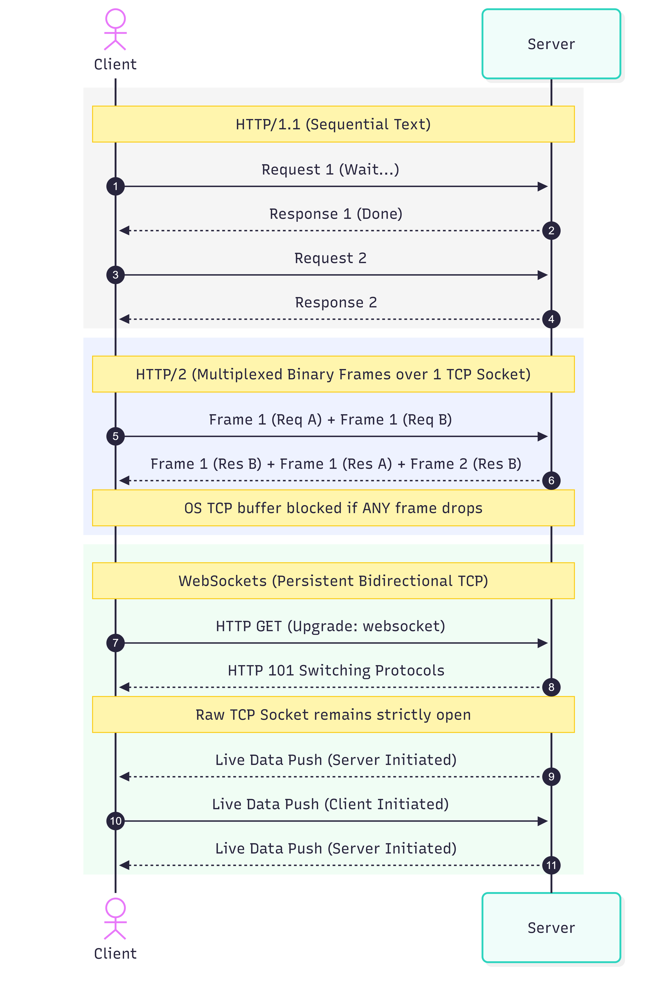

# 2.1 Application Layer (HTTP/1.1 to HTTP/3 & WebSockets)

### Setup Stage

In Phase 1, we established how the Operating System moves raw, mathematically verified binary bytes across the wire via TCP. However, the OS Kernel does not care what those bytes mean.

In Phase 2, we move into the **Application Layer**. We must establish a strict structural protocol so that the receiving process knows how to parse those raw bytes into meaningful commands (like routing a request or reading a JSON body). This structural protocol is HTTP (Hypertext Transfer Protocol).

To observe and build HTTP servers, we will use our existing Node.js environment. We will also use `curl`, a command-line tool that acts as an HTTP client, allowing us to inspect the raw string headers before they are abstracted away by the browser.

Please open your WSL2/Linux terminal and run the following commands to create your directory structure for Phase 2, and verify `curl` is available:

```bash
# Verify curl is installed (it usually comes pre-installed on Ubuntu/WSL2)
curl --version

# Verify Node.js is still active in your environment
node --version
```

***

### Stage 1: Concept & Core Problem (HTTP/1.1 to HTTP/3 & WebSockets)

Let us start from the absolute basics of what an Application Layer protocol actually is.

#### Step 1: The Parsing Problem

In Phase 1, we saw that a TCP socket simply delivers a stream of raw bytes into the OS Kernel's Receive Buffer. The OS hands these bytes to the application (like Node.js).

However, if the application receives `01001000 01101001`, how does it know if those bytes represent a database query, an image file, or a request to delete a user?
**The Core Problem:** The raw TCP stream has no boundaries and no structural meaning.
**The Solution:** The Application Layer Protocol. Both the client and the server agree on a strict string-formatting rule. Before sending the actual payload (the image or the JSON), the sender prefixes it with specific text strings. This is exactly what **HTTP (Hypertext Transfer Protocol)** is: a standardized set of text-string rules for formatting TCP payloads.

#### Step 2: HTTP/1.1 (The Standard & Keep-Alive)

When a browser sends an HTTP/1.1 request, it physically writes an ASCII string into the TCP socket that looks exactly like this:

```text
GET /users HTTP/1.1\r\n
Host: api.server.com\r\n
Authorization: Bearer token123\r\n
\r\n
```

The server application reads bytes from the socket until it detects the `\r\n\r\n` (Carriage Return + Line Feed). This exact byte sequence tells the server's memory parser: *"The headers have ended. Everything after this is the payload."*

* **The Engineering Problem Solved by 1.1:** Earlier versions of HTTP (1.0) closed the TCP connection immediately after one request. As we learned in Phase 1, the TCP 3-Way Handshake takes time. If a webpage required 50 images, the client OS had to perform 50 separate TCP Handshakes, exhausting OS socket limits.
* **The HTTP/1.1 Solution:** `Connection: keep-alive`. The server keeps the Socket File Descriptor (`FD 4`) open after the first response. The client reuses that exact same TCP connection for the next 49 images.
* **The HTTP/1.1 Bottleneck (Head-of-Line Blocking):** Because it is a single TCP stream of text, requests must be strictly sequential. The client must ask for Image 1, wait for the server to send all bytes of Image 1, and only then ask for Image 2. If Image 1 is a massive 50MB file, the socket is blocked. Image 2 cannot be requested until the socket is completely free.

#### Step 3: HTTP/2 (Binary Framing & Multiplexing)

To solve this Application-Level blocking, HTTP/2 fundamentally changed how data is written to the socket. It abandoned plain text strings.

* **The Mechanics:** HTTP/2 breaks the data down into **Binary Frames**. It introduces a concept called **Multiplexing** over a single TCP connection.
* The client can send a frame for Request A (e.g., Stream ID: 1), immediately followed by a frame for Request B (Stream ID: 2). The server interleaves the responses.
* **The HTTP/2 Bottleneck (TCP Head-of-Line Blocking):** While HTTP/2 solved blocking at the *Application* layer, it hit a wall at the *OS Kernel* layer. Remember TCP's Sequence Numbers? If a network router drops one packet belonging to Request A, the OS Kernel halts the *entire* TCP socket until that packet is retransmitted. Even though all the packets for Request B arrived perfectly, the OS Kernel refuses to hand them to Node.js because TCP guarantees strict ordering. One dropped packet freezes all multiplexed streams.

#### Step 4: HTTP/3 (QUIC - Abandoning TCP)

To solve the TCP Kernel bottleneck, Google engineers realized they had to bypass the OS Kernel's TCP enforcement entirely.

* **The Mechanics:** HTTP/3 Abandons TCP. It uses **UDP**. As we learned, UDP has no sequence numbers, no handshake, and no reliability. It just blasts packets into the application's memory.
* The engineers wrote a new protocol called **QUIC** that sits inside the Application Layer (User Space). QUIC implements its own mathematical sequencing and reliability per *stream*, rather than per *socket*.
* If a packet for Stream A is dropped over UDP, the application pauses Stream A to request a retransmission, but continues processing the UDP packets arriving for Stream B. They are now mathematically independent.

#### Step 5: WebSockets (Bidirectional State)

HTTP is strictly **unidirectional** and **stateless**. The Client must initiate the request, and the Server responds. The Server can *never* initiate a message to the Client, because HTTP requires a request string to trigger a response.

* **The Engineering Problem:** How do we build a live chat application? If we use HTTP, the client has to send an empty TCP request every 1 second asking, *"Do I have new messages?"* (Long Polling). This burns CPU cycles and network bandwidth.
* **The Solution:** WebSockets. The client sends a standard HTTP/1.1 request containing a special header: `Upgrade: websocket`. The server parses this, agrees, and they both essentially say: *"Let us stop using HTTP parsing rules."* They keep the underlying TCP socket open and switch to a raw, bidirectional binary framing protocol. The server can now push bytes into the socket at any time, instantly triggering an event on the client's CPU.

#### Visual Data Flow

Visualizing the memory and network flow evolution from HTTP/1.1 to WebSockets.



***

### Doubt Clearance and Q/A

> **Q1. Before moving to stage 2. Can you explain the difference between websockets and UDP?**

**Answer**

This is a very common point of confusion because both WebSockets and UDP allow for rapid, continuous streams of data. However, mechanically, they exist at completely different layers of the networking stack and operate using entirely different mathematical rules.

Here is the fundamental distinction: **WebSockets run *on top of* TCP. UDP is an alternative *to* TCP.**

Let us break down the exact mechanical differences.

#### 1. The Network Layering (Where they exist)

* **UDP (Transport Layer - Layer 4):** UDP is a core Operating System protocol. It deals with raw IP addresses, Ports, and the physical network card. The OS Kernel handles UDP packets directly.
* **WebSockets (Application Layer - Layer 7):** WebSockets are a high-level protocol. To create a WebSocket, the OS *must* first establish a fully reliable TCP connection (with the 3-Way Handshake, Sequence Numbers, and ACK packets). Once the OS establishes that TCP socket, the application (like Node.js) uses that TCP socket to send WebSocket-formatted binary frames.

#### 2. Reliability and Ordering (The Math)

* **WebSockets (Reliable):** Because WebSockets use TCP under the hood, they inherit all of TCP's mathematical guarantees. If you send 5 chat messages over a WebSocket and the router drops message #3, the underlying OS Kernel will halt the socket, demand a retransmission of packet #3, and ensure the application receives them in the exact order: 1, 2, 3, 4, 5. **You will never lose a WebSocket message unless the connection completely drops.**
* **UDP (Unreliable):** UDP has no sequence numbers and no ACKs. If you blast 5 packets and packet #3 is dropped, the receiving application simply receives 1, 2, 4, 5. The OS does not care, and it will never ask for a retransmission.

#### 3. Connection State and Setup

* **WebSockets (Stateful):** To open a WebSocket, the client must first send a full HTTP text request to the server (`Upgrade: websocket`). The server must parse this, allocate specific Application Layer memory structures, and reply with an HTTP `101 Switching Protocols` response. Only then can data flow. This connection requires continuous memory overhead on the server.
* **UDP (Stateless):** There is absolutely no handshake. The sender just formats a packet and fires it out of the network card. The receiving server does not "accept" a connection; it just reads the packet out of its memory buffer. It requires virtually zero memory overhead to track users.

### 4. Which one do engineers choose?

You choose based on the exact engineering problem your application faces regarding **Stale Data vs. Missing Data**.

* **When to use WebSockets:** Chat applications (WhatsApp), Financial Trading Dashboards, or collaborative document editing (Google Docs).
  * *Why:* In a bank or a chat app, **Missing Data** is catastrophic. You cannot simply drop a "Sell 100 shares" command or lose a paragraph of text. You gladly accept the slight milliseconds of latency caused by TCP retransmissions to guarantee mathematical certainty.
* **When to use UDP:** First-Person Shooter Games (Call of Duty), Live Voice calls (Discord/Zoom), or high-frequency telemetry data.
  * *Why:* In a fast-paced game, **Stale Data** is catastrophic. If the server drops the packet containing the enemy's location from 50 milliseconds ago, you *do not* want the OS to pause the game, request a retransmission, and show you where the enemy *used* to be. You just want the OS to throw it away and give you the absolute newest coordinate immediately.

**Summary:** WebSockets give you bidirectional, instantaneous data pushes with the absolute mathematical reliability of TCP. UDP gives you raw speed by abandoning all reliability and handshakes.

***
